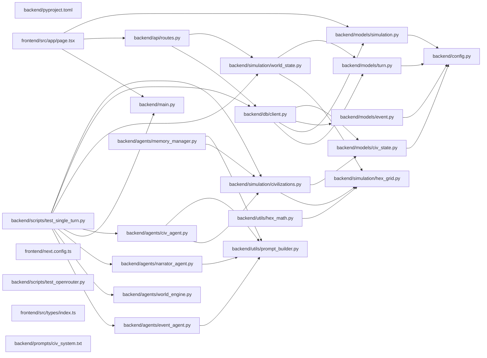

## ARCHITECTURE

A software project composed of the following subsystems:

- **backend/**: Primary subsystem containing 37 files
- **frontend/**: Primary subsystem containing 31 files
- **configs/**: Primary subsystem containing 2 files
- **Root**: Contains scripts and execution points

## ENTRY_POINTS

### `backend/main.py`

```python
def main():
    print("Hello from backend!")


if __name__ == "__main__":
    main()

```

## SYMBOL_INDEX

**`backend/models/civ_state.py`**
- class `Resources`
  - `__str__()`
  - `__repr__()`
- class `CivState`

**`backend/models/simulation.py`**
- class `SimStatus`
- class `SimConfig`
- class `Simulation`

**`backend/main.py`**
- `main()`

**`backend/models/turn.py`**
- class `TileSnapshot`
- class `CivResourceSnapshot`
- class `WorldSnapshot`
- class `Turn`

**`backend/utils/prompt_builder.py`**
- `load_template()`
- `build_civ_system_prompt()`
- `build_civ_user_message()`
- `build_world_summary()`
- `build_narrator_user_message()`
- `build_event_agent_user_message()`
- `build_memory_user_message()`

**`backend/simulation/civilizations.py`**
- `load_civs_config()`
- `build_initial_civ_states()`
- `get_civ_config()`
- `get_civ_personality()`
- `get_all_civ_ids()`

**`backend/simulation/hex_grid.py`**
- class `Hex`
  - `__add__()`
  - `__sub__()`
  - `length()`
  - `distance()`
- `hex_neighbors()`
- `hex_distance()`
- `hex_ring()`
- `hex_spiral()`
- `hex_to_pixel()`
- `pixel_to_hex()`
- `hex_round()`
- `generate_grid_coords()`
- `get_corner_hexes()`

**`backend/db/client.py`**
- `connect_db()`
- `close_db()`
- `ping_db()`

**`backend/models/event.py`**
- class `EventType`
- class `Event`

**`backend/api/routes.py`**
- `health()`
- `world_preview()`
- `_tile_distribution()`

**`backend/simulation/world_state.py`**
- `_load_world_params()`
- `_load_civs_config()`
- `_pick_tile_type()`
- `_get_resource_yield()`
- `_assign_starting_tiles()`
- `generate_world()`
- `world_snapshot_to_dict()`

**`backend/config.py`**
- class `Settings`

**`frontend/src/app/page.tsx`**
- `HomePage()`

**`backend/agents/civ_agent.py`**
- `get_civ_decision()`
- `get_all_civ_decisions()`
- `_parse_and_validate()`
- `_fallback_decision()`

**`backend/agents/event_agent.py`**
- `roll_world_event()`
- `_parse_event()`
- `_apply_event()`

**`backend/agents/narrator_agent.py`**
- `narrate_turn()`
- `_ordinal()`

**`backend/agents/world_engine.py`**
- `resolve_turn()`
- `_resolve_war()`
- `_resolve_capture()`
- `_resolve_trade()`
- `_resolve_alliance()`
- `_resolve_infrastructure()`
- `_build_tile_owner_map()`
- `_seize_border_tile()`
- `_adjust_relationship()`
- `_get_relationship()`
- `_apply_resource_tick()`
- `_sync_tile_counts()`

**`backend/agents/memory_manager.py`**
- `get_memory_summary()`
- `refresh_all_memories()`
- `should_refresh()`

**`backend/utils/hex_math.py`**
- `get_tiles_in_range()`
- `get_border_tiles()`
- `get_territory_size()`
- `is_connected()`
- `find_path()`
- `tiles_owned_by()`
- `domination_percentage()`

**`frontend/src/app/simulation/[id]/page.tsx`**
- `SimulationPage()`

## IMPORTANT_CALL_PATHS

main.main()
## CORE_MODULES

### `backend/models/civ_state.py`

**Purpose:** Implements civ state.

**Types:**
- `CivState` (bases: `Document`)
- `Resources` (bases: `BaseModel`) methods: `__repr__`, `__str__`

### `backend/models/simulation.py`

**Purpose:** Implements simulation.

**Types:**
- `SimConfig` (bases: `BaseModel`)
- `SimStatus` (bases: `str, Enum`)
- `Simulation` (bases: `Document`)

### `backend/CONTEXT.md`

**Purpose:** Implements CONTEXT.

**Notes:** large file (565 lines)

### `backend/models/turn.py`

**Purpose:** Implements turn.

**Types:**
- `CivResourceSnapshot` (bases: `BaseModel`)
- `TileSnapshot` (bases: `BaseModel`)
- `Turn` (bases: `Document`)
- `WorldSnapshot` (bases: `BaseModel`)

### `backend/utils/prompt_builder.py`

**Purpose:** Builds prompt strings from .txt templates and world state data.

**Functions:**
- `def build_civ_system_prompt(civ_id: str, civ_name: str, traits: list[str], personality: str, ...) -> str`
- `def build_civ_user_message(turn: int, civ_state: dict, world_summary: str, memory_summary: str) -> str`
- `def build_event_agent_user_message(     turn: int,     world_snapshot: dict,     civ_states: dict, ) -> str`
- `def build_memory_user_message(civ_id: str, civ_name: str, event_log: list[dict], current_state: dict) -> str`

### `backend/simulation/civilizations.py`

**Purpose:** Loads civilization configs and builds initial CivState documents

**Functions:**
- `def build_initial_civ_states(sim_id: str, civ_tiles: dict[str, list], ...) -> list[CivState]`
  - Build turn-0 CivState documents for all 4 civs.
- `def get_all_civ_ids() -> list[str]`
- `def get_civ_config(civ_id: str) -> dict | None`
  - Look up a single civ's config by ID.
- `def get_civ_personality(civ_id: str) -> str`
  - Return the personality string for use in agent system prompts.
- `def load_civs_config() -> list[dict]`
  - Load raw civ config from JSON.

## Constants
CIVS_CONFIG_PATH = _BASE / "configs" / "default_civs.json"

### `backend/simulation/hex_grid.py`

**Purpose:** Hex grid using axial coordinates (q, r) with pointy-top orientation.

**Types:**
- `Hex` methods: `distance`, `length`

**Functions:**
- `def generate_grid_coords(grid_size: int) -> list[Hex]`
- `def get_corner_hexes(grid_size: int) -> dict[str, Hex]`
- `def hex_distance(a: Hex, b: Hex) -> int`
- `def hex_neighbors(h: Hex) -> list[Hex]`
- `def hex_ring(center: Hex, radius: int) -> list[Hex]`
- `def hex_round(fq: float, fr: float) -> Hex`

## Constants
HEX_DIRECTIONS = <complex expression>

### `backend/db/client.py`

**Purpose:** Implements client.

**Functions:**
- `def close_db() -> None`
- `def connect_db() -> None`
- `def ping_db() -> bool`

### `backend/models/event.py`

**Purpose:** Implements event.

**Types:**
- `Event` (bases: `Document`)
- `EventType` (bases: `str, Enum`)

## SUPPORTING_MODULES

### `backend/api/routes.py`

```python
def health()

def world_preview(grid_size: int = 15, seed: int | None = None)
    """Generate and return a fresh world without saving to DB.
    Useful for verifying world generation before wiring up the frontend map."""

def _tile_distribution(tiles: list[dict]) -> dict[str, int]

```

### `frontend/CONTEXT.md`

*176 lines, 0 imports*

### `backend/simulation/world_state.py`

> 
World state generator.
Builds a fresh 15×15 hex grid with tile types, resources, and civ starting positions.


```python
def _load_world_params() -> dict

def _load_civs_config() -> list[dict]

def _pick_tile_type(params: dict, rng: random.Random) -> str
    """Weighted random tile type selection."""

def _get_resource_yield(tile_type: str, params: dict) -> tuple[float, float, float]
    """Return (food, gold, stone) yield for a tile type."""

def _assign_starting_tiles(
    civ_id: str,
    corner: Hex,
    all_hex_set: set[Hex],
    already_owned: set[Hex],
    n: int = 3,
) -> list[Hex]
    """Give a civ `n` contiguous starting tiles centred on its corner.
    Uses spiral expansion so tiles are always adjacent."""

def generate_world(
    grid_size: int | None = None,
    seed: int | None = None,
) -> tuple[WorldSnapshot, dict[str, list[Hex]]]
    """Generate a fresh world.

    Returns:
        world_snapshot: WorldSnapshot — ready to store in MongoDB
        civ_tiles: dict mapping civ_id → list of their starting Hex positions"""

def world_snapshot_to_dict(snapshot: WorldSnapshot) -> dict
    """Serialize WorldSnapshot to a plain dict for API responses."""

```

### `backend/config.py`

```python
class Settings(BaseSettings)

```

### `frontend/src/app/page.tsx`

```typescript
function HomePage()

```

### `backend/agents/civ_agent.py`

> 
Civilization agent — each civ observes the world and returns a structured decision.


```python
def get_civ_decision(
    civ_id: str,
    turn: int,
    civ_state: dict,
    all_civ_states: dict,
    world_snapshot: dict,
    memory_summary: str = "",
    max_retries: int = 2,
) -> dict
    """Ask a civilization agent what it wants to do this turn.

    Returns a validated decision dict:
    {
        "civ_id": str,
        "action": str,
        "target": str | None,
        "reasoning": str,
        "tone": str,
    }"""

def get_all_civ_decisions(
    turn: int,
    civ_states: dict,
    world_snapshot: dict,
    memory_summaries: dict[str, str] | None = None,
) -> dict[str, dict]
    """Ask all alive civs for their decisions in parallel.
    Returns dict mapping civ_id → decision."""

def _parse_and_validate(raw: str, civ_id: str) -> dict | None
    """Parse JSON response and validate it has the required fields."""

def _fallback_decision(civ_id: str, action: str, reasoning: str) -> dict

```

### `backend/agents/event_agent.py`

> 
Event agent — rolls each turn for a random world event.
20% chance per turn. Uses an LLM to pick the most dramatically interesting event.


```python
def roll_world_event(
    turn: int,
    world_snapshot: dict,
    civ_states: dict,
    force: bool = False,
) -> dict | None
    """Roll for a world event this turn.

    Args:
        turn: current turn number
        world_snapshot: current world state
        civ_states: current civ states
        force: if True, always fire an event (for testing)

    Returns:
        event dict if an event fired, None otherwise"""

def _parse_event(raw: str) -> dict | None

def _apply_event(
    data: dict,
    civ_states: dict,
    world_snapshot: dict,
    turn: int,
) -> dict
    """Apply the event effects to world/civ state and return an event record."""

```

### `backend/agents/narrator_agent.py`

> 
Narrator agent — writes 2-3 sentences of historical lore each turn.


```python
def narrate_turn(
    turn: int,
    events: list[dict],
    world_event: dict | None = None,
) -> str
    """Write a historical narrative for the turn.

    Args:
        turn: current turn number
        events: list of resolved event dicts from world engine
        world_event: optional world event dict from event agent

    Returns:
        narrative string (2-3 sentences of lore)"""

def _ordinal(n: int) -> str

```

### `backend/agents/world_engine.py`

> 
World engine — pure Python logic that adjudicates all civ decisions
and produces an updated world state + turn diff.
No LLM calls here. This is the referee.


```python
def resolve_turn(
    turn: int,
    decisions: dict[str, dict],
    civ_states: dict[str, dict],
    world_snapshot: dict,
    world_params: dict,
) -> tuple[dict, dict, list[dict]]
    """Adjudicate all decisions for a turn.

    Returns:
        updated_civ_states: dict — new civ states after resolution
        updated_world:      dict — updated world snapshot
        events:             list — list of resolved event dicts for narrator/DB"""

def _resolve_war(
    attacker_id: str,
    target_id: str | None,
    civ_states: dict,
    world: dict,
    tile_owners: dict,
    turn: int,
) -> dict | None

def _resolve_capture(
    civ_id: str,
    target: str | None,
    civ_states: dict,
    world: dict,
    tile_owners: dict,
    turn: int,
) -> dict | None

def _resolve_trade(
    proposer_id: str,
    target_id: str | None,
    civ_states: dict,
    turn: int,
) -> dict | None

def _resolve_alliance(
    proposer_id: str,
    target_id: str | None,
    civ_states: dict,
    turn: int,
) -> dict | None

def _resolve_infrastructure(
    civ_id: str,
    civ_states: dict,
    world: dict,
    turn: int,
) -> dict | None

def _build_tile_owner_map(world: dict) -> dict[tuple, str | None]

def _seize_border_tile(
    attacker_id: str,
    defender_id: str,
    world: dict,
    tile_owners: dict,
) -> str | None
    """Seize one border tile from defender. Returns tile coords string or None."""

def _adjust_relationship(
    civ_states: dict,
    civ_a: str,
    civ_b: str,
    delta: int,
) -> None
    """Adjust relationship score between two civs symmetrically, clamped to [-100, 100]."""

def _get_relationship(civ_states: dict, civ_a: str, civ_b: str) -> int

def _apply_resource_tick(
    civ_states: dict,
    world: dict,
    world_params: dict,
) -> None
    """Each owned tile yields its resources to the owning civ."""

def _sync_tile_counts(civ_states: dict, world: dict) -> None
    """Recalculate tile_count for all civs from the world state."""

```

### `README.md`

*234 lines, 0 imports*

### `frontend/next.config.ts`

*8 lines, 0 imports*

### `backend/agents/memory_manager.py`

> 
Memory manager — compresses each civ's event history into a short
memory summary injected into their agent prompt each turn.


```python
def get_memory_summary(
    civ_id: str,
    event_log: list[dict],
    current_state: dict,
) -> str
    """Compress a civ's event history into a 3-sentence memory summary.

    Args:
        civ_id: the civilization ID
        event_log: full event log filtered/unfiltered
        current_state: current CivState dict

    Returns:
        memory summary string"""

def refresh_all_memories(
    turn: int,
    civ_states: dict,
    event_log: list[dict],
    existing_summaries: dict[str, str],
) -> dict[str, str]
    """Refresh memory summaries for all alive civs.
    Only runs every COMPRESS_EVERY turns to save API calls.

    Args:
        turn: current turn number
        civ_states: current civ states
        event_log: full simulation event log so far
        existing_summaries: previous memory summaries

    Returns:
        updated memory summaries dict"""

def should_refresh(turn: int) -> bool

```

### `backend/utils/hex_math.py`

> 
Utility functions built on top of hex_grid.py.
Used by world engine, agents, and battle resolution.


```python
def get_tiles_in_range(center: Hex, radius: int, all_tiles: set[Hex]) -> list[Hex]
    """Return all valid grid tiles within `radius` steps of center."""

def get_border_tiles(
    owned_tiles: set[Hex],
    all_tiles: set[Hex],
) -> list[Hex]
    """Return neutral/enemy tiles that are adjacent to at least one owned tile.
    Used by civ agents to find expansion targets."""

def get_territory_size(owned_tiles: set[Hex]) -> int

def is_connected(owned_tiles: set[Hex]) -> bool
    """Check if a civ's territory is fully connected (no isolated tiles).
    Uses BFS flood fill."""

def find_path(
    start: Hex,
    end: Hex,
    passable_tiles: set[Hex],
) -> list[Hex] | None
    """BFS pathfinding between two hexes through passable tiles.
    Returns the path as a list of hexes, or None if unreachable."""

def tiles_owned_by(
    owner_id: str,
    tile_owners: dict[Hex, str | None],
) -> set[Hex]
    """Return the set of tiles owned by a specific civ."""

def domination_percentage(
    owner_id: str,
    tile_owners: dict[Hex, str | None],
) -> float
    """What fraction of the total grid does this civ own?"""

```

### `frontend/src/types/index.ts`

*4 lines, 0 imports*

### `backend/prompts/civ_system.txt`

*45 lines, 0 imports*

### `backend/prompts/event_agent.txt`

*36 lines, 0 imports*

### `backend/prompts/memory_system.txt`

*26 lines, 0 imports*

### `backend/prompts/narrator_system.txt`

*41 lines, 0 imports*

### `frontend/src/app/simulation/[id]/page.tsx`

```typescript
function SimulationPage({ params }: { params: { id: string } })

```

## DEPENDENCY_GRAPH



## RANKED_FILES

| File | Score | Tier | Tokens |
|------|-------|------|--------|
| `backend/models/civ_state.py` | 0.573 | structured summary | 55 |
| `backend/models/simulation.py` | 0.573 | structured summary | 53 |
| `backend/CONTEXT.md` | 0.550 | structured summary | 22 |
| `backend/main.py` | 0.524 | full source | 33 |
| `backend/pyproject.toml` | 0.500 | one-liner | 13 |
| `backend/models/turn.py` | 0.463 | structured summary | 66 |
| `backend/utils/prompt_builder.py` | 0.448 | structured summary | 153 |
| `backend/simulation/civilizations.py` | 0.432 | structured summary | 193 |
| `backend/simulation/hex_grid.py` | 0.432 | structured summary | 165 |
| `backend/db/client.py` | 0.427 | structured summary | 44 |
| `backend/models/event.py` | 0.427 | structured summary | 39 |
| `backend/api/routes.py` | 0.420 | signatures | 77 |
| `frontend/CONTEXT.md` | 0.397 | signatures | 15 |
| `backend/simulation/world_state.py` | 0.396 | signatures | 306 |
| `backend/config.py` | 0.391 | signatures | 16 |
| `frontend/src/app/page.tsx` | 0.359 | signatures | 17 |
| `backend/agents/civ_agent.py` | 0.339 | signatures | 273 |
| `backend/agents/event_agent.py` | 0.339 | signatures | 206 |
| `backend/agents/narrator_agent.py` | 0.339 | signatures | 134 |
| `backend/agents/world_engine.py` | 0.303 | signatures | 582 |
| `README.md` | 0.302 | signatures | 13 |
| `backend/scripts/test_single_turn.py` | 0.283 | one-liner | 11 |
| `frontend/next.config.ts` | 0.273 | signatures | 16 |
| `backend/agents/memory_manager.py` | 0.258 | signatures | 250 |
| `backend/scripts/test_openrouter.py` | 0.245 | one-liner | 22 |
| `backend/utils/hex_math.py` | 0.242 | signatures | 331 |
| `frontend/src/types/index.ts` | 0.239 | signatures | 16 |
| `backend/prompts/civ_system.txt` | 0.233 | signatures | 18 |
| `backend/prompts/event_agent.txt` | 0.233 | signatures | 17 |
| `backend/prompts/memory_system.txt` | 0.233 | signatures | 17 |
| `backend/prompts/narrator_system.txt` | 0.233 | signatures | 19 |
| `frontend/src/app/simulation/[id]/page.tsx` | 0.226 | signatures | 34 |
| `backend/api/server.py` | 0.201 | one-liner | 20 |
| `backend/db/indexes.py` | 0.201 | one-liner | 21 |
| `frontend/src/lib/apiClient.ts` | 0.201 | one-liner | 18 |
| `frontend/src/app/layout.tsx` | 0.195 | one-liner | 22 |
| `backend/scripts/test_worldgen.py` | 0.194 | one-liner | 11 |
| `backend/scripts/smoke_test.py` | 0.189 | one-liner | 11 |
| `backend/utils/llm.py` | 0.189 | one-liner | 22 |
| `frontend/src/app/history/page.tsx` | 0.189 | one-liner | 23 |

## PERIPHERY

- `backend/pyproject.toml` — 36 lines
- `backend/scripts/test_single_turn.py` — 
- `backend/scripts/test_openrouter.py` — 1 function, 4 imports, 61 lines
- `backend/api/server.py` — 1 function, 8 imports, 42 lines
- `backend/db/indexes.py` — 1 function, 5 imports, 22 lines
- `frontend/src/lib/apiClient.ts` — 1 function, 20 lines
- `frontend/src/app/layout.tsx` — 1 function, 3 imports, 34 lines
- `backend/scripts/test_worldgen.py` — 
- `backend/scripts/smoke_test.py` — 
- `backend/utils/llm.py` — 1 function, 5 imports, 65 lines
- `frontend/src/app/history/page.tsx` — 1 function, 1 imports, 17 lines
- `backend/simulation/__init__.py` — 3 imports, 9 lines
- `backend/models/__init__.py` — 4 imports, 11 lines
- `frontend/src/store/simStore.ts` — 2 imports, 27 lines
- `frontend/src/store/worldStore.ts` — 2 imports, 20 lines
- `frontend/src/types/civilization.ts` — 33 lines
- `frontend/src/types/events.ts` — 43 lines
- `frontend/src/types/simulation.ts` — 22 lines
- `frontend/src/types/world.ts` — 33 lines
- `backend/utils/__init__.py` — 1 imports, 14 lines
- `.gitignore` — 24 lines
- `configs/default_civs.json` — 58 lines
- `configs/world_params.json` — 19 lines
- `frontend/src/store/eventStore.ts` — 2 imports, 25 lines
- `backend/.gitignore` — 98 lines
- `backend/.python-version` — 2 lines
- `backend/README.md` — 0 lines
- `frontend/.gitignore` — 62 lines
- `frontend/AGENTS.md` — 6 lines
- `frontend/CLAUDE.md` — 2 lines
- `frontend/README.md` — 37 lines
- `frontend/eslint.config.mjs` — 3 imports, 19 lines
- `frontend/package-lock.json` — 7401 lines
- `frontend/package.json` — 31 lines
- `frontend/postcss.config.mjs` — 8 lines
- `frontend/public/file.svg` — 1 lines
- `frontend/public/globe.svg` — 1 lines
- `frontend/public/next.svg` — 1 lines
- `frontend/public/vercel.svg` — 1 lines
- `frontend/public/window.svg` — 1 lines
- `frontend/src/app/globals.css` — 27 lines
- `frontend/tsconfig.json` — 35 lines
- `frontend/next-env.d.ts` — 1 imports, 7 lines

