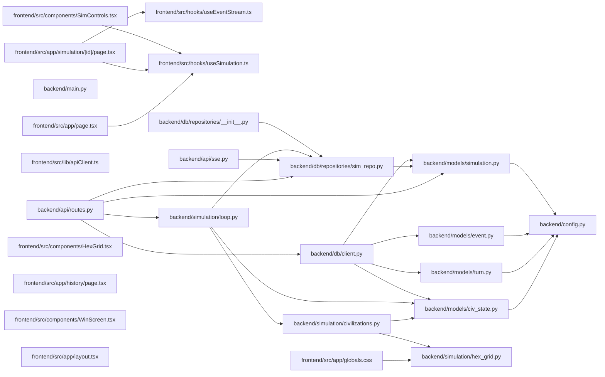

## ARCHITECTURE

A software project composed of the following subsystems:

- **frontend/**: Primary subsystem containing 56 files
- **backend/**: Primary subsystem containing 46 files
- **configs/**: Primary subsystem containing 2 files
- **Root**: Contains scripts and execution points

## ENTRY_POINTS

### `backend/main.py`

```python
def main():
    print("Hello from backend!")


if __name__ == "__main__":
    main()
# uv run uvicorn api.server:app --reload

```

## SYMBOL_INDEX

**`frontend/src/app/page.tsx`**
- `HomePage()`
- `StatBox()`

**`backend/models/civ_state.py`**
- class `Resources`
  - `__str__()`
  - `__repr__()`
- class `CivState`

**`backend/models/turn.py`**
- class `TileSnapshot`
- class `CivResourceSnapshot`
- class `WorldSnapshot`
- class `Turn`

**`backend/api/routes.py`**
- `health()`
- `world_preview()`
- class `StartSimRequest`
- `start_simulation()`
- `pause_simulation()`
- `resume_simulation()`
- `stop_simulation()`
- `delete_sim()`
- `get_sim()`
- `get_sim_events()`
- `get_sim_turns()`
- `list_simulations()`
- `_tile_distribution()`
- `get_sim_summary()`
- `export_simulation()`
- `get_sim_turn()`

**`backend/main.py`**
- `main()`

**`backend/db/repositories/sim_repo.py`**
- `create_simulation()`
- `get_simulation()`
- `_oid()`
- `_set_fields()`
- `update_sim_turn()`
- `update_sim_status()`
- `mark_sim_stopped()`
- `set_sim_winner()`
- `get_all_simulations()`
- `is_sim_paused()`
- `delete_simulation()`

**`frontend/src/app/simulation/[id]/page.tsx`**
- `SimulationPage()`

**`backend/models/event.py`**
- class `EventType`
- class `Event`

**`backend/models/simulation.py`**
- class `SimStatus`
- class `SimConfig`
- class `Simulation`

**`frontend/src/hooks/useEventStream.ts`**
- `sleep()`
- `computeRelationshipShifts()`
- `useEventStream()`

**`frontend/src/lib/apiClient.ts`**
- `apiFetch()`

**`frontend/src/hooks/useSimulation.ts`**
- `useSimulation()`

**`frontend/src/components/SimControls.tsx`**
- `SimControls()`

**`backend/simulation/hex_grid.py`**
- class `Hex`
  - `__add__()`
  - `__sub__()`
  - `length()`
  - `distance()`
- `hex_neighbors()`
- `hex_distance()`
- `hex_ring()`
- `hex_spiral()`
- `hex_to_pixel()`
- `pixel_to_hex()`
- `hex_round()`
- `generate_grid_coords()`
- `get_corner_hexes()`

**`frontend/src/components/HexGrid.tsx`**
- `tileKey()`
- `HexGrid()`
- `getTileFill()`
- `getTileStroke()`
- `blendColors()`
- `hexToRgb()`

**`backend/api/sse.py`**
- class `SseManager`
  - `__init__()`
  - `create_channel()`
  - `publish()`
  - `subscribe()`
  - `close_channel()`
- `stream_simulation()`

**`backend/simulation/civilizations.py`**
- `load_civs_config()`
- `build_initial_civ_states()`
- `get_civ_config()`
- `get_civ_personality()`
- `get_all_civ_ids()`

**`backend/simulation/loop.py`**
- `_load_world_params()`
- class `SimState`
- `_civ_doc_to_dict()`
- `increment_turn()`
- `run_civ_agents()`
- `run_world_engine()`
- `run_event_agent()`
- `run_narrator()`
- `refresh_memory()`
- `persist_turn()`
- `check_winner()`
- `should_continue()`
- `build_simulation_graph()`
- `run_simulation_loop()`

**`frontend/src/app/history/page.tsx`**
- `HistoryPage()`

**`frontend/src/components/WinScreen.tsx`**
- `WinScreen()`
- `ConfettiBurst()`

**`frontend/src/app/layout.tsx`**
- `RootLayout()`

**`backend/config.py`**
- class `Settings`

**`backend/db/client.py`**
- `connect_db()`
- `close_db()`
- `ping_db()`

**`backend/api/server.py`**
- `lifespan()`

**`frontend/src/lib/hexUtils.ts`**
- `hexToPixel()`
- `hexCorners()`
- `tilesBounds()`
- `gridBounds()`

**`frontend/src/hooks/useReplay.ts`**
- `useReplay()`

**`backend/db/repositories/event_repo.py`**
- `_safe_event_type()`
- `save_events()`
- `get_events_for_turn()`
- `get_events_for_sim()`
- `get_events_as_dicts()`

**`backend/utils/prompt_builder.py`**
- `load_template()`
- `build_civ_system_prompt()`
- `build_civ_user_message()`
- `build_world_summary()`
- `build_narrator_user_message()`
- `build_event_agent_user_message()`
- `build_memory_user_message()`

**`frontend/src/components/CivPanel.tsx`**
- `moodLabel()`
- `CivPanel()`
- `CivCard()`
- `Trend()`
- `Sparkline()`
- `ResourceBar()`
- `RelDot()`

**`frontend/src/hooks/useFocusTrap.ts`**
- `useFocusTrap()`

**`frontend/src/components/EventFeed.tsx`**
- `eventMatchesFilter()`
- `EventFeed()`
- `NarratorBlock()`
- `EventCard()`
- `RelationshipShiftCard()`
- `buildTurns()`

**`backend/db/repositories/turn_repo.py`**
- `_dict_to_world_snapshot()`
- `save_turn()`
- `get_turn()`
- `get_all_turns()`

**`frontend/src/components/SimSummary.tsx`**
- `SimSummary()`

**`backend/simulation/judge.py`**
- class `WinResult`
- `check_win()`

**`frontend/src/components/ReplayControls.tsx`**
- `ReplayControls()`

**`backend/simulation/world_state.py`**
- `_load_world_params()`
- `_load_civs_config()`
- `_pick_tile_type()`
- `_get_resource_yield()`
- `_assign_starting_tiles()`
- `generate_world()`
- `world_snapshot_to_dict()`

## IMPORTANT_CALL_PATHS

main.main()
## CORE_MODULES

### `frontend/src/app/page.tsx`

**Purpose:** Implements page.

**Functions:**
- `function HomePage()`
- `function StatBox({ label, value, color, accent }: { label: string; value: number; color?: string; accent: string })`

**Notes:** large file (561 lines)

### `backend/models/civ_state.py`

**Purpose:** Implements civ state.

**Types:**
- `CivState` (bases: `Document`)
- `Resources` (bases: `BaseModel`) methods: `__repr__`, `__str__`

### `backend/models/turn.py`

**Purpose:** Implements turn.

**Types:**
- `CivResourceSnapshot` (bases: `BaseModel`)
- `TileSnapshot` (bases: `BaseModel`)
- `Turn` (bases: `Document`)
- `WorldSnapshot` (bases: `BaseModel`)

### `backend/api/routes.py`

**Purpose:** FastAPI routes — all API endpoints.

**Types:**
- `StartSimRequest` (bases: `BaseModel`)

**Functions:**
- `def _tile_distribution(tiles: list[dict]) -> dict[str, int]`
- `def delete_sim(sim_id: str)`
- `def export_simulation(sim_id: str)`
- `def get_sim(sim_id: str)`
- `def get_sim_events(sim_id: str, turn: int | None = None)`
- `def get_sim_summary(sim_id: str)`
- `def get_sim_turn(sim_id: str, turn_num: int)`
- `def get_sim_turns(sim_id: str)`

**Notes:** decorator-heavy (14 decorators); large file (319 lines)

### `backend/db/repositories/sim_repo.py`

**Purpose:** Simulation repository — clean data access for Simulation documents.

**Functions:**
- `def _oid(sim_id: str) -> ObjectId | None`
- `def _set_fields(sim_id: str, fields: dict) -> None`
- `def create_simulation(     civ_ids: list[str],     config: SimConfig | None = None, ) -> Simulation`
- `def delete_simulation(sim_id: str) -> bool`
- `def get_all_simulations(limit: int = 20) -> list[Simulation]`
- `def get_simulation(sim_id: str) -> Simulation | None`
- `def is_sim_paused(sim_id: str) -> bool`
- `def mark_sim_stopped(sim_id: str) -> None`

### `frontend/src/app/simulation/[id]/page.tsx`

**Purpose:** Implements page.

**Functions:**
- `function SimulationPage()`

**Notes:** large file (342 lines)

### `backend/models/event.py`

**Purpose:** Implements event.

**Types:**
- `Event` (bases: `Document`)
- `EventType` (bases: `str, Enum`)

### `backend/models/simulation.py`

**Purpose:** Implements simulation.

**Types:**
- `SimConfig` (bases: `BaseModel`)
- `SimStatus` (bases: `str, Enum`)
- `Simulation` (bases: `Document`)

### `README.md`

**Purpose:** Implements README.

### `frontend/src/hooks/useEventStream.ts`

**Purpose:** Implements useEventStream.

**Functions:**
- `function computeRelationshipShifts(`
- `const sleep = ...`
- `function useEventStream(simId: string | null)`

### `frontend/src/lib/apiClient.ts`

**Purpose:** Implements apiClient.

**Functions:**
- `async function apiFetch<T>(path: string, options?: RequestInit): Promise<T>`

### `frontend/src/hooks/useSimulation.ts`

**Purpose:** Implements useSimulation.

**Functions:**
- `function useSimulation()`

### `frontend/src/components/SimControls.tsx`

**Purpose:** Implements SimControls.

**Functions:**
- `function SimControls(`

### `backend/simulation/hex_grid.py`

**Purpose:** Hex grid using axial coordinates (q, r) with pointy-top orientation.

**Types:**
- `Hex` methods: `distance`, `length`

**Functions:**
- `def generate_grid_coords(grid_size: int) -> list[Hex]`
- `def get_corner_hexes(grid_size: int) -> dict[str, Hex]`
- `def hex_distance(a: Hex, b: Hex) -> int`
- `def hex_neighbors(h: Hex) -> list[Hex]`
- `def hex_ring(center: Hex, radius: int) -> list[Hex]`
- `def hex_round(fq: float, fr: float) -> Hex`

## Constants
HEX_DIRECTIONS = <complex expression>

### `frontend/src/app/globals.css`

**Purpose:** Implements globals.

**Notes:** decorator-heavy (17 decorators)

## SUPPORTING_MODULES

### `frontend/src/components/HexGrid.tsx`

```typescript
const tileKey = ...

function HexGrid()

function getTileFill(d: HexTile): string

function getTileStroke(d: HexTile): string

function blendColors(base: string, overlay: string, alpha: number): string

function hexToRgb(hex: string)

```

### `backend/api/sse.py`

> 
SSE manager — in-memory pub/sub for streaming simulation turn events.
Each simulation gets its own asyncio.Queue.
Clients connect to GET /api/sim/{id}/stream and receive events as they fire.


```python
class SseManager

def stream_simulation(sim_id: str)
    """SSE endpoint — streams turn events for a running simulation.
    Connect once and receive JSON events as each turn completes."""

```

### `backend/simulation/civilizations.py`

> 
Loads civilization configs and builds initial CivState documents
for a new simulation run.


```python
def load_civs_config() -> list[dict]
    """Load raw civ config from JSON."""

def build_initial_civ_states(
    sim_id: str,
    civ_tiles: dict[str, list],  # civ_id → list of starting Hex
) -> list[CivState]
    """Build turn-0 CivState documents for all 4 civs.
    Called once when a simulation starts.

    Args:
        sim_id: The MongoDB ID of the simulation run
        civ_tiles: Mapping from civ_id to their starting tile hexes

    Returns:
        List of CivState documents (not yet inserted to DB)"""

def get_civ_config(civ_id: str) -> dict | None
    """Look up a single civ's config by ID."""

def get_civ_personality(civ_id: str) -> str
    """Return the personality string for use in agent system prompts.
    Returns empty string if civ not found."""

def get_all_civ_ids() -> list[str]

```

### `backend/simulation/loop.py`

> 
LangGraph simulation loop.
Defines SimState and the full turn-cycle graph:
  increment_turn → run_civ_agents → run_world_engine → run_event_agent
  → run_narrator → refresh_memory → persist_turn → check_winner
  → (winner? END : back to increment_turn)


```python
def _load_world_params() -> dict

class SimState(TypedDict)

def _civ_doc_to_dict(state: CivState) -> dict

def increment_turn(state: SimState) -> SimState

def run_civ_agents(state: SimState) -> SimState

def run_world_engine(state: SimState) -> SimState

def run_event_agent(state: SimState) -> SimState

def run_narrator(state: SimState) -> SimState

def refresh_memory(state: SimState) -> SimState

def persist_turn(state: SimState) -> SimState

def check_winner(state: SimState) -> SimState

def should_continue(state: SimState) -> str

def build_simulation_graph() -> StateGraph

def run_simulation_loop(sim_id: str) -> None
    """Main entry point. Called as a background task from POST /api/sim/start.
    Builds initial state from MongoDB, runs the LangGraph loop until done."""

```

### `backend/db/repositories/__init__.py`

*42 lines, 3 imports*

### `frontend/src/app/history/page.tsx`

```typescript
function HistoryPage()

```

### `frontend/src/components/WinScreen.tsx`

```typescript
function WinScreen({ onViewSummary }: WinScreenProps)

function ConfettiBurst({ color }: { color: string })

```

### `backend/CONTEXT.md`

*735 lines, 0 imports*

### `frontend/src/app/layout.tsx`

```typescript
function RootLayout(

```

### `backend/config.py`

```python
class Settings(BaseSettings)

```

### `backend/db/client.py`

```python
def connect_db() -> None

def close_db() -> None

def ping_db() -> bool

```

### `frontend/src/store/simStore.ts`

*31 lines, 2 imports*

### `frontend/src/store/worldStore.ts`

*63 lines, 2 imports*

### `backend/api/server.py`

```python
def lifespan(app: FastAPI)

```

### `frontend/src/lib/hexUtils.ts`

```typescript
function hexToPixel(q: number, r: number, size = HEX_SIZE)

function hexCorners(cx: number, cy: number, size = HEX_SIZE): string

function tilesBounds(tiles: Array<{ q: number; r: number }>, size = HEX_SIZE)

function gridBounds(gridSize = 15, size = HEX_SIZE)

```

### `frontend/src/hooks/useReplay.ts`

```typescript
function useReplay(simId: string, totalTurns: number)

```

### `backend/db/repositories/event_repo.py`

> 
Event repository — save and query simulation events.


```python
def _safe_event_type(type_str: str) -> EventType
    """Safely convert string to EventType, falling back to civ_idle."""

def save_events(
    sim_id: str,
    turn: int,
    events: list[dict],
) -> list[Event]
    """Bulk insert events for a turn."""

def get_events_for_turn(sim_id: str, turn: int) -> list[Event]
    """Fetch all events for a specific turn."""

def get_events_for_sim(sim_id: str) -> list[Event]
    """Fetch full event log for a simulation."""

def get_events_as_dicts(sim_id: str) -> list[dict]
    """Fetch full event log as plain dicts for agent memory."""

```

### `backend/utils/prompt_builder.py`

> 
Builds prompt strings from .txt templates and world state data.


```python
def load_template(filename: str) -> str
    """Load a prompt template from the prompts/ directory."""

def build_civ_system_prompt(
    civ_id: str,
    civ_name: str,
    traits: list[str],
    personality: str,
    all_civ_configs: list[dict],
) -> str
    """Build the system prompt for a civilization agent."""

def build_civ_user_message(
    turn: int,
    civ_state: dict,
    world_summary: str,
    memory_summary: str,
) -> str
    """Build the user message for a civilization agent each turn."""

def build_world_summary(
    world_snapshot: dict,
    civ_states: dict,
    exclude_civ_id: str,
) -> str
    """Build a compact world state summary string for injection into civ prompts.
    Excludes the civ's own state (already shown separately)."""

def build_narrator_user_message(
    turn: int,
    turn_diff: dict,
) -> str
    """Build the user message for the narrator agent."""

def build_event_agent_user_message(
    turn: int,
    world_snapshot: dict,
    civ_states: dict,
) -> str
    """Build the user message for the event agent."""

def build_memory_user_message(
    civ_id: str,
    civ_name: str,
    event_log: list[dict],
    current_state: dict,
) -> str
    """Build the user message for the memory manager."""

```

### `frontend/src/lib/civColors.ts`

*62 lines, 2 imports*

### `frontend/src/components/CivPanel.tsx`

```typescript
function moodLabel(score: number): string

function CivPanel()

function CivCard(

function Trend({ now, before }: { now: number; before: number | undefined })

function Sparkline({ points, color }: { points: number[]; color: string })

function ResourceBar(

function RelDot({ civId, score }: { civId: string; score: number })

```

### `frontend/src/hooks/useFocusTrap.ts`

```typescript
function useFocusTrap<T extends HTMLElement>(active: boolean)

```

### `frontend/src/components/EventFeed.tsx`

```typescript
function eventMatchesFilter(type: string, filter: FeedFilter): boolean

function EventFeed()

function NarratorBlock({ turn, text, isLatest }: { turn: number; text: string; isLatest: boolean })

function EventCard({ event }: { event: SimEvent })

function RelationshipShiftCard({ event }: { event: SimEvent })

function buildTurns(

```

### `backend/db/repositories/turn_repo.py`

> 
Turn repository — save and query turn snapshots.


```python
def _dict_to_world_snapshot(world_dict: dict) -> WorldSnapshot
    """Convert raw world dict to WorldSnapshot model."""

def save_turn(
    sim_id: str,
    turn: int,
    world_snapshot_dict: dict,
) -> Turn
    """Save a turn snapshot to MongoDB."""

def get_turn(sim_id: str, turn: int) -> Turn | None
    """Fetch a specific turn snapshot."""

def get_all_turns(sim_id: str) -> list[Turn]
    """Fetch all turns for a simulation (for replay)."""

```

### `frontend/src/types/events.ts`

*44 lines, 0 imports*

### `frontend/src/components/SimSummary.tsx`

```typescript
function SimSummary({ simId, isVisible, onClose }: SimSummaryProps)

```

### `frontend/CONTEXT.md`

*176 lines, 0 imports*

### `backend/simulation/judge.py`

> 
Judge — checks win conditions after every turn.
Returns a WinResult if someone won, None if game continues.


```python
class WinResult

def check_win(
    turn: int,
    civ_states: dict,
    world_snapshot: dict,
    max_turns: int = 50,
    domination_threshold: float = 0.60,
) -> WinResult | None
    """Check all win conditions for the current turn.

    Returns WinResult if someone won, None if game continues."""

```

### `frontend/src/components/ReplayControls.tsx`

```typescript
function ReplayControls(

```

### `backend/simulation/world_state.py`

> 
World state generator.
Builds a fresh 15×15 hex grid with tile types, resources, and civ starting positions.


```python
def _load_world_params() -> dict

def _load_civs_config() -> list[dict]

def _pick_tile_type(params: dict, rng: random.Random) -> str
    """Weighted random tile type selection."""

def _get_resource_yield(tile_type: str, params: dict) -> tuple[float, float, float]
    """Return (food, gold, stone) yield for a tile type."""

def _assign_starting_tiles(
    civ_id: str,
    corner: Hex,
    all_hex_set: set[Hex],
    already_owned: set[Hex],
    n: int = 3,
) -> list[Hex]
    """Give a civ `n` contiguous starting tiles centred on its corner.
    Uses spiral expansion so tiles are always adjacent."""

def generate_world(
    grid_size: int | None = None,
    seed: int | None = None,
) -> tuple[WorldSnapshot, dict[str, list[Hex]]]
    """Generate a fresh world.

    Returns:
        world_snapshot: WorldSnapshot — ready to store in MongoDB
        civ_tiles: dict mapping civ_id → list of their starting Hex positions"""

def world_snapshot_to_dict(snapshot: WorldSnapshot) -> dict
    """Serialize WorldSnapshot to a plain dict for API responses."""

```

## DEPENDENCY_GRAPH



### Cyclic Dependencies

> [!WARNING]
> The following circular import chains were detected:

1. `backend/simulation/loop.py` -> `backend/simulation/world_state.py`

## RANKED_FILES

| File | Score | Tier | Tokens |
|------|-------|------|--------|
| `frontend/src/app/page.tsx` | 0.545 | structured summary | 66 |
| `backend/models/civ_state.py` | 0.491 | structured summary | 55 |
| `backend/models/turn.py` | 0.491 | structured summary | 66 |
| `backend/api/routes.py` | 0.480 | structured summary | 164 |
| `backend/main.py` | 0.460 | full source | 45 |
| `backend/db/repositories/sim_repo.py` | 0.458 | structured summary | 166 |
| `frontend/src/app/simulation/[id]/page.tsx` | 0.436 | structured summary | 40 |
| `backend/models/event.py` | 0.429 | structured summary | 39 |
| `backend/models/simulation.py` | 0.429 | structured summary | 53 |
| `README.md` | 0.426 | structured summary | 11 |
| `frontend/src/hooks/useEventStream.ts` | 0.388 | structured summary | 50 |
| `frontend/src/lib/apiClient.ts` | 0.385 | structured summary | 40 |
| `frontend/src/hooks/useSimulation.ts` | 0.380 | structured summary | 27 |
| `frontend/src/components/SimControls.tsx` | 0.379 | structured summary | 28 |
| `backend/simulation/hex_grid.py` | 0.368 | structured summary | 165 |
| `frontend/src/app/globals.css` | 0.352 | structured summary | 24 |
| `frontend/src/components/HexGrid.tsx` | 0.321 | signatures | 72 |
| `backend/api/sse.py` | 0.309 | signatures | 95 |
| `backend/simulation/civilizations.py` | 0.306 | signatures | 240 |
| `backend/simulation/loop.py` | 0.301 | signatures | 275 |
| `backend/db/repositories/__init__.py` | 0.296 | signatures | 19 |
| `frontend/src/app/history/page.tsx` | 0.290 | signatures | 19 |
| `frontend/src/components/WinScreen.tsx` | 0.284 | signatures | 40 |
| `backend/CONTEXT.md` | 0.279 | signatures | 15 |
| `frontend/src/app/layout.tsx` | 0.278 | signatures | 18 |
| `backend/config.py` | 0.275 | signatures | 16 |
| `backend/db/client.py` | 0.275 | signatures | 33 |
| `frontend/src/store/simStore.ts` | 0.271 | signatures | 18 |
| `frontend/src/store/worldStore.ts` | 0.270 | signatures | 17 |
| `backend/api/server.py` | 0.270 | signatures | 19 |
| `frontend/src/lib/hexUtils.ts` | 0.260 | signatures | 87 |
| `frontend/src/hooks/useReplay.ts` | 0.257 | signatures | 30 |
| `backend/db/repositories/event_repo.py` | 0.245 | signatures | 174 |
| `backend/utils/prompt_builder.py` | 0.245 | signatures | 331 |
| `frontend/src/lib/civColors.ts` | 0.233 | signatures | 18 |
| `frontend/src/components/CivPanel.tsx` | 0.231 | signatures | 92 |
| `frontend/src/hooks/useFocusTrap.ts` | 0.227 | signatures | 27 |
| `frontend/src/components/EventFeed.tsx` | 0.226 | signatures | 91 |
| `backend/db/repositories/turn_repo.py` | 0.214 | signatures | 141 |
| `frontend/package-lock.json` | 0.213 | one-liner | 13 |

## PERIPHERY

- `frontend/package-lock.json` — 7466 lines
- `frontend/package.json` — 33 lines
- `backend/scripts/test_openrouter.py` — 1 function, 4 imports, 61 lines
- `backend/pyproject.toml` — 36 lines
- `frontend/src/types/index.ts` — 4 lines
- `frontend/src/components/HexFieldCanvas.tsx` — 1 function, 2 imports, 207 lines
- `backend/agents/civ_agent.py` — 
- `backend/agents/event_agent.py` — 
- `backend/agents/narrator_agent.py` — 
- `backend/agents/world_engine.py` — 
- `backend/utils/hex_math.py` — 
- `CLAUDE.md` — 111 lines
- `backend/simulation/__init__.py` — 5 imports, 13 lines
- `backend/scripts/test_full_sim.py` — 
- `frontend/src/components/ConfirmDialog.tsx` — 1 function, 2 imports, 74 lines
- `frontend/src/components/ErrorBoundary.tsx` — 1 class, 1 imports, 47 lines
- `frontend/src/components/RelationshipMatrix.tsx` — 2 functions, 3 imports, 92 lines
- `frontend/src/components/ToastNotification.tsx` — 1 function, 2 imports, 48 lines
- `frontend/src/components/TurnTimeline.tsx` — 1 function, 2 imports, 54 lines
- `frontend/src/store/toastStore.ts` — 1 imports, 38 lines
- `frontend/src/store/uiStore.ts` — 1 imports, 32 lines
- `.gitignore` — 26 lines
- `frontend/next.config.ts` — 8 lines
- `backend/db/repositories/summary_repo.py` — 
- `backend/agents/memory_manager.py` — 
- `backend/db/indexes.py` — 1 function, 5 imports, 22 lines
- `backend/scripts/test_single_turn.py` — 
- `backend/scripts/test_worldgen.py` — 
- `backend/scripts/smoke_test.py` — 
- `backend/utils/llm.py` — 1 function, 5 imports, 65 lines
- `frontend/next-env.d.ts` — 1 imports, 7 lines
- `frontend/tsconfig.tsbuildinfo` — 1 lines
- `frontend/src/components/Icons.tsx` — 1 function, 1 imports, 89 lines
- `backend/models/__init__.py` — 4 imports, 11 lines
- `frontend/src/types/civilization.ts` — 33 lines
- `frontend/src/types/simulation.ts` — 22 lines
- `frontend/src/types/world.ts` — 33 lines
- `backend/utils/__init__.py` — 1 imports, 14 lines
- `frontend/src/components/Skeletons.tsx` — 3 functions, 52 lines
- `frontend/src/components/Spinner.tsx` — 1 function, 6 lines
- `backend/prompts/civ_system.txt` — 45 lines
- `backend/prompts/event_agent.txt` — 36 lines
- `backend/prompts/memory_system.txt` — 26 lines
- `backend/prompts/narrator_system.txt` — 41 lines
- `configs/default_civs.json` — 58 lines
- `configs/world_params.json` — 19 lines
- `frontend/src/store/eventStore.ts` — 2 imports, 25 lines
- `backend/.gitignore` — 98 lines
- `backend/.python-version` — 2 lines
- `backend/README.md` — 0 lines
- `frontend/.gitignore` — 62 lines
- `frontend/AGENTS.md` — 6 lines
- `frontend/CLAUDE.md` — 2 lines
- `frontend/README.md` — 37 lines
- `frontend/eslint.config.mjs` — 3 imports, 19 lines
- `frontend/postcss.config.mjs` — 8 lines
- `frontend/public/file.svg` — 1 lines
- `frontend/public/globe.svg` — 1 lines
- `frontend/public/next.svg` — 1 lines
- `frontend/public/vercel.svg` — 1 lines
- `frontend/public/window.svg` — 1 lines
- `frontend/tsconfig.json` — 35 lines

