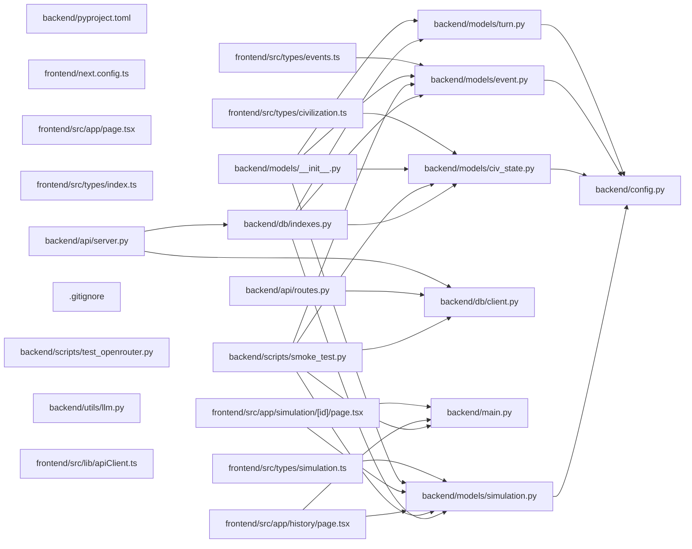

## ARCHITECTURE

A software project composed of the following subsystems:

- **frontend/**: Primary subsystem containing 30 files
- **backend/**: Primary subsystem containing 18 files
- **configs/**: Primary subsystem containing 2 files
- **Root**: Contains scripts and execution points

## ENTRY_POINTS

### `backend/main.py`

```python
def main():
    print("Hello from backend!")


if __name__ == "__main__":
    main()

```

## SYMBOL_INDEX

**`backend/models/simulation.py`**
- class `SimStatus`
- class `SimConfig`
- class `Simulation`

**`backend/models/civ_state.py`**
- class `Resources`
  - `__str__()`
  - `__repr__()`
- class `CivState`

**`backend/models/event.py`**
- class `EventType`
- class `Event`

**`backend/config.py`**
- class `Settings`

**`backend/db/client.py`**
- `connect_db()`
- `close_db()`
- `ping_db()`

**`backend/main.py`**
- `main()`

**`frontend/src/app/page.tsx`**
- `HomePage()`

**`backend/models/turn.py`**
- class `TileSnapshot`
- class `CivResourceSnapshot`
- class `WorldSnapshot`
- class `Turn`

**`backend/db/indexes.py`**
- `create_indexes()`

**`frontend/src/app/history/page.tsx`**
- `HistoryPage()`

**`frontend/src/app/simulation/[id]/page.tsx`**
- `SimulationPage()`

**`backend/api/routes.py`**
- `health()`

**`backend/api/server.py`**
- `lifespan()`

**`backend/utils/llm.py`**
- `generate_completion()`

**`frontend/src/lib/apiClient.ts`**
- `apiFetch()`

## IMPORTANT_CALL_PATHS

main.main()
## CORE_MODULES

### `backend/models/simulation.py`

**Purpose:** Implements simulation.

**Types:**
- `SimConfig` (bases: `BaseModel`)
- `SimStatus` (bases: `str, Enum`)
- `Simulation` (bases: `Document`)

### `backend/models/civ_state.py`

**Purpose:** Implements civ state.

**Types:**
- `CivState` (bases: `Document`)
- `Resources` (bases: `BaseModel`) methods: `__repr__`, `__str__`

### `backend/models/event.py`

**Purpose:** Implements event.

**Types:**
- `Event` (bases: `Document`)
- `EventType` (bases: `str, Enum`)

### `backend/config.py`

**Purpose:** Implements config.

**Types:**
- `Settings` (bases: `BaseSettings`)

### `backend/db/client.py`

**Purpose:** Implements client.

**Functions:**
- `def close_db() -> None`
- `def connect_db() -> None`
- `def ping_db() -> bool`

### `frontend/next.config.ts`

**Purpose:** Implements next.config.

### `frontend/src/app/page.tsx`

**Purpose:** Implements page.

**Functions:**
- `function HomePage()`

## SUPPORTING_MODULES

### `backend/models/turn.py`

```python
class TileSnapshot(BaseModel)

class CivResourceSnapshot(BaseModel)

class WorldSnapshot(BaseModel)

class Turn(Document)

```

### `frontend/src/types/index.ts`

*4 lines, 0 imports*

### `backend/db/indexes.py`

```python
def create_indexes() -> None

```

### `frontend/src/app/history/page.tsx`

```typescript
function HistoryPage()

```

### `frontend/src/app/simulation/[id]/page.tsx`

```typescript
function SimulationPage({ params }: { params: { id: string } })

```

### `backend/api/routes.py`

```python
def health()

```

### `backend/api/server.py`

```python
def lifespan(app: FastAPI)

```

### `backend/models/__init__.py`

*11 lines, 4 imports*

### `frontend/src/types/civilization.ts`

*33 lines, 0 imports*

### `frontend/src/types/events.ts`

*43 lines, 0 imports*

### `frontend/src/types/simulation.ts`

*22 lines, 0 imports*

### `.gitignore`

*24 lines, 0 imports*

### `backend/utils/llm.py`

```python
def generate_completion(
    prompt: str, 
    system_prompt: str = "You are an assistant helping run a civilization simulation.",
    temperature: float = 0.7,
    max_tokens: int = 1000
) -> str
    """Generate completion using OpenRouter and the configured free model.
    Sends request asynchronously using standard asyncio executors if needed, 
    or synchronously for simplicity depending on application calling patterns."""

```

### `frontend/src/lib/apiClient.ts`

```typescript
async function apiFetch<T>(

```

### `frontend/src/store/eventStore.ts`

*25 lines, 2 imports*

### `frontend/src/store/simStore.ts`

*27 lines, 2 imports*

### `frontend/src/store/worldStore.ts`

*20 lines, 2 imports*

### `frontend/src/types/world.ts`

*33 lines, 0 imports*

## DEPENDENCY_GRAPH



## RANKED_FILES

| File | Score | Tier | Tokens |
|------|-------|------|--------|
| `backend/models/simulation.py` | 0.733 | structured summary | 53 |
| `backend/models/civ_state.py` | 0.600 | structured summary | 55 |
| `backend/models/event.py` | 0.600 | structured summary | 39 |
| `backend/config.py` | 0.592 | structured summary | 27 |
| `backend/db/client.py` | 0.533 | structured summary | 44 |
| `backend/main.py` | 0.500 | full source | 33 |
| `backend/pyproject.toml` | 0.500 | one-liner | 13 |
| `frontend/next.config.ts` | 0.500 | structured summary | 15 |
| `frontend/src/app/page.tsx` | 0.500 | structured summary | 25 |
| `backend/models/turn.py` | 0.453 | signatures | 36 |
| `frontend/src/types/index.ts` | 0.400 | signatures | 16 |
| `backend/db/indexes.py` | 0.392 | signatures | 20 |
| `backend/scripts/smoke_test.py` | 0.350 | one-liner | 11 |
| `frontend/src/app/history/page.tsx` | 0.350 | signatures | 19 |
| `frontend/src/app/simulation/[id]/page.tsx` | 0.350 | signatures | 34 |
| `backend/api/routes.py` | 0.325 | signatures | 15 |
| `backend/api/server.py` | 0.325 | signatures | 19 |
| `backend/models/__init__.py` | 0.325 | signatures | 17 |
| `frontend/src/types/civilization.ts` | 0.325 | signatures | 18 |
| `frontend/src/types/events.ts` | 0.325 | signatures | 16 |
| `frontend/src/types/simulation.ts` | 0.325 | signatures | 17 |
| `.gitignore` | 0.300 | signatures | 13 |
| `backend/scripts/test_openrouter.py` | 0.300 | one-liner | 22 |
| `backend/utils/llm.py` | 0.300 | signatures | 103 |
| `configs/default_civs.json` | 0.300 | one-liner | 14 |
| `configs/world_params.json` | 0.300 | one-liner | 12 |
| `frontend/src/lib/apiClient.ts` | 0.300 | signatures | 21 |
| `frontend/src/store/eventStore.ts` | 0.300 | signatures | 17 |
| `frontend/src/store/simStore.ts` | 0.300 | signatures | 18 |
| `frontend/src/store/worldStore.ts` | 0.300 | signatures | 17 |
| `frontend/src/types/world.ts` | 0.300 | signatures | 16 |
| `backend/.gitignore` | 0.200 | one-liner | 12 |
| `backend/.python-version` | 0.200 | one-liner | 12 |
| `backend/README.md` | 0.200 | one-liner | 12 |
| `frontend/.gitignore` | 0.200 | one-liner | 12 |
| `frontend/AGENTS.md` | 0.200 | one-liner | 13 |
| `frontend/CLAUDE.md` | 0.200 | one-liner | 14 |
| `frontend/README.md` | 0.200 | one-liner | 12 |
| `frontend/eslint.config.mjs` | 0.200 | one-liner | 18 |
| `frontend/package-lock.json` | 0.200 | one-liner | 13 |

## PERIPHERY

- `backend/pyproject.toml` — 37 lines
- `backend/scripts/smoke_test.py` — 
- `backend/scripts/test_openrouter.py` — 1 function, 4 imports, 61 lines
- `configs/default_civs.json` — 58 lines
- `configs/world_params.json` — 19 lines
- `backend/.gitignore` — 98 lines
- `backend/.python-version` — 2 lines
- `backend/README.md` — 0 lines
- `frontend/.gitignore` — 62 lines
- `frontend/AGENTS.md` — 6 lines
- `frontend/CLAUDE.md` — 2 lines
- `frontend/README.md` — 37 lines
- `frontend/eslint.config.mjs` — 3 imports, 19 lines
- `frontend/package-lock.json` — 7401 lines
- `frontend/package.json` — 31 lines
- `frontend/postcss.config.mjs` — 8 lines
- `frontend/public/file.svg` — 1 lines
- `frontend/public/globe.svg` — 1 lines
- `frontend/public/next.svg` — 1 lines
- `frontend/public/vercel.svg` — 1 lines
- `frontend/public/window.svg` — 1 lines
- `frontend/src/app/globals.css` — 27 lines
- `frontend/src/app/layout.tsx` — 1 function, 3 imports, 34 lines
- `frontend/tsconfig.json` — 35 lines
- `frontend/next-env.d.ts` — 1 imports, 7 lines

