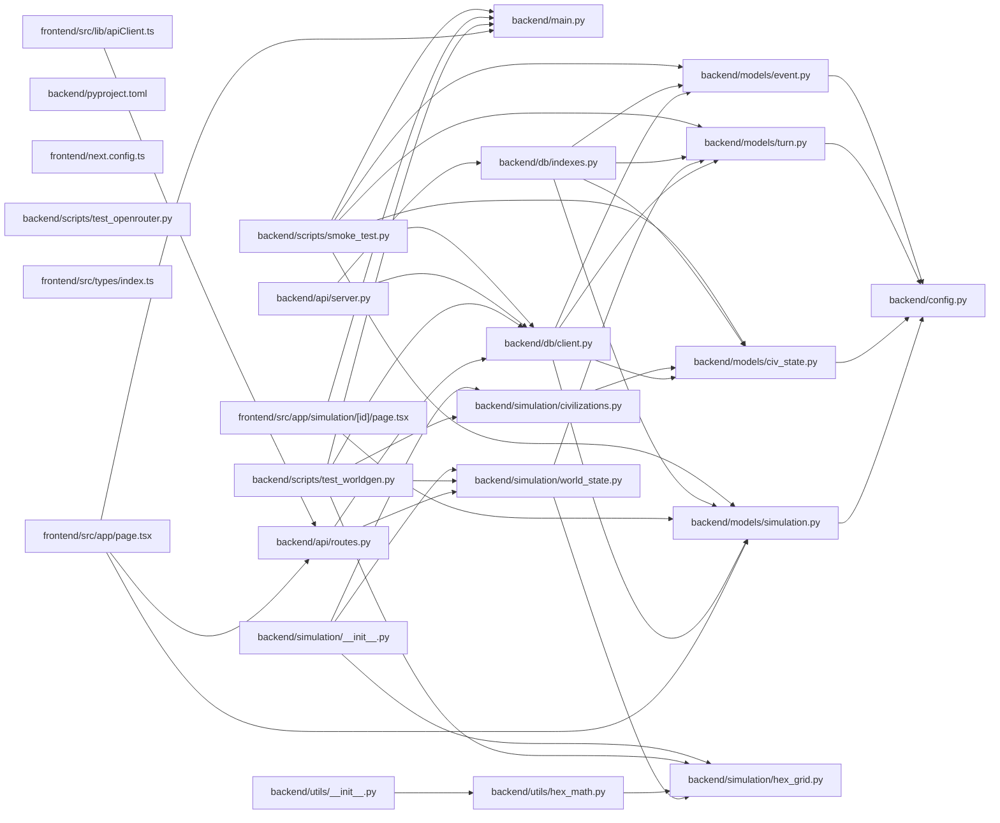

## ARCHITECTURE

A software project composed of the following subsystems:

- **frontend/**: Primary subsystem containing 31 files
- **backend/**: Primary subsystem containing 26 files
- **configs/**: Primary subsystem containing 2 files
- **Root**: Contains scripts and execution points

## ENTRY_POINTS

### `backend/main.py`

```python
def main():
    print("Hello from backend!")


if __name__ == "__main__":
    main()

```

## SYMBOL_INDEX

**`backend/models/simulation.py`**
- class `SimStatus`
- class `SimConfig`
- class `Simulation`

**`backend/models/civ_state.py`**
- class `Resources`
  - `__str__()`
  - `__repr__()`
- class `CivState`

**`backend/api/routes.py`**
- `health()`
- `world_preview()`
- `_tile_distribution()`

**`backend/models/turn.py`**
- class `TileSnapshot`
- class `CivResourceSnapshot`
- class `WorldSnapshot`
- class `Turn`

**`backend/main.py`**
- `main()`

**`backend/models/event.py`**
- class `EventType`
- class `Event`

**`frontend/src/app/page.tsx`**
- `HomePage()`

**`backend/simulation/hex_grid.py`**
- class `Hex`
  - `__add__()`
  - `__sub__()`
  - `length()`
  - `distance()`
- `hex_neighbors()`
- `hex_distance()`
- `hex_ring()`
- `hex_spiral()`
- `hex_to_pixel()`
- `pixel_to_hex()`
- `hex_round()`
- `generate_grid_coords()`
- `get_corner_hexes()`

**`backend/config.py`**
- class `Settings`

**`backend/db/client.py`**
- `connect_db()`
- `close_db()`
- `ping_db()`

**`backend/simulation/world_state.py`**
- `_load_world_params()`
- `_load_civs_config()`
- `_pick_tile_type()`
- `_get_resource_yield()`
- `_assign_starting_tiles()`
- `generate_world()`
- `world_snapshot_to_dict()`

**`backend/simulation/civilizations.py`**
- `load_civs_config()`
- `build_initial_civ_states()`
- `get_civ_config()`
- `get_civ_personality()`
- `get_all_civ_ids()`

**`backend/utils/hex_math.py`**
- `get_tiles_in_range()`
- `get_border_tiles()`
- `get_territory_size()`
- `is_connected()`
- `find_path()`
- `tiles_owned_by()`
- `domination_percentage()`

**`frontend/src/app/simulation/[id]/page.tsx`**
- `SimulationPage()`

**`backend/api/server.py`**
- `lifespan()`

**`backend/db/indexes.py`**
- `create_indexes()`

**`frontend/src/lib/apiClient.ts`**
- `apiFetch()`

**`backend/utils/llm.py`**
- `generate_completion()`

**`frontend/src/app/history/page.tsx`**
- `HistoryPage()`

## IMPORTANT_CALL_PATHS

main.main()
## CORE_MODULES

### `backend/models/simulation.py`

**Purpose:** Implements simulation.

**Types:**
- `SimConfig` (bases: `BaseModel`)
- `SimStatus` (bases: `str, Enum`)
- `Simulation` (bases: `Document`)

### `backend/models/civ_state.py`

**Purpose:** Implements civ state.

**Types:**
- `CivState` (bases: `Document`)
- `Resources` (bases: `BaseModel`) methods: `__repr__`, `__str__`

### `backend/api/routes.py`

**Purpose:** Implements routes.

**Functions:**
- `def _tile_distribution(tiles: list[dict]) -> dict[str, int]`
- `def health()`
- `def world_preview(grid_size: int = 15, seed: int | None = None)`
  - Generate and return a fresh world without saving to DB.

### `backend/models/turn.py`

**Purpose:** Implements turn.

**Types:**
- `CivResourceSnapshot` (bases: `BaseModel`)
- `TileSnapshot` (bases: `BaseModel`)
- `Turn` (bases: `Document`)
- `WorldSnapshot` (bases: `BaseModel`)

### `backend/models/event.py`

**Purpose:** Implements event.

**Types:**
- `Event` (bases: `Document`)
- `EventType` (bases: `str, Enum`)

### `frontend/src/app/page.tsx`

**Purpose:** Implements page.

**Functions:**
- `function HomePage()`

### `README.md`

**Purpose:** Implements README.

### `backend/simulation/hex_grid.py`

**Purpose:** Hex grid using axial coordinates (q, r) with pointy-top orientation.

**Types:**
- `Hex` methods: `distance`, `length`

**Functions:**
- `def generate_grid_coords(grid_size: int) -> list[Hex]`
- `def get_corner_hexes(grid_size: int) -> dict[str, Hex]`
- `def hex_distance(a: Hex, b: Hex) -> int`
- `def hex_neighbors(h: Hex) -> list[Hex]`
- `def hex_ring(center: Hex, radius: int) -> list[Hex]`
- `def hex_round(fq: float, fr: float) -> Hex`

## Constants
HEX_DIRECTIONS = <complex expression>

## SUPPORTING_MODULES

### `backend/config.py`

```python
class Settings(BaseSettings)

```

### `backend/db/client.py`

```python
def connect_db() -> None

def close_db() -> None

def ping_db() -> bool

```

### `backend/simulation/world_state.py`

> 
World state generator.
Builds a fresh 15×15 hex grid with tile types, resources, and civ starting positions.


```python
def _load_world_params() -> dict

def _load_civs_config() -> list[dict]

def _pick_tile_type(params: dict, rng: random.Random) -> str
    """Weighted random tile type selection."""

def _get_resource_yield(tile_type: str, params: dict) -> tuple[float, float, float]
    """Return (food, gold, stone) yield for a tile type."""

def _assign_starting_tiles(
    civ_id: str,
    corner: Hex,
    all_hex_set: set[Hex],
    already_owned: set[Hex],
    n: int = 3,
) -> list[Hex]
    """Give a civ `n` contiguous starting tiles centred on its corner.
    Uses spiral expansion so tiles are always adjacent."""

def generate_world(
    grid_size: int | None = None,
    seed: int | None = None,
) -> tuple[WorldSnapshot, dict[str, list[Hex]]]
    """Generate a fresh world.

    Returns:
        world_snapshot: WorldSnapshot — ready to store in MongoDB
        civ_tiles: dict mapping civ_id → list of their starting Hex positions"""

def world_snapshot_to_dict(snapshot: WorldSnapshot) -> dict
    """Serialize WorldSnapshot to a plain dict for API responses."""

```

### `frontend/next.config.ts`

*8 lines, 0 imports*

### `backend/simulation/civilizations.py`

> 
Loads civilization configs and builds initial CivState documents
for a new simulation run.


```python
def load_civs_config() -> list[dict]
    """Load raw civ config from JSON."""

def build_initial_civ_states(
    sim_id: str,
    civ_tiles: dict[str, list],  # civ_id → list of starting Hex
) -> list[CivState]
    """Build turn-0 CivState documents for all 4 civs.
    Called once when a simulation starts.

    Args:
        sim_id: The MongoDB ID of the simulation run
        civ_tiles: Mapping from civ_id to their starting tile hexes

    Returns:
        List of CivState documents (not yet inserted to DB)"""

def get_civ_config(civ_id: str) -> dict | None
    """Look up a single civ's config by ID."""

def get_civ_personality(civ_id: str) -> str
    """Return the personality string for use in agent system prompts.
    Returns empty string if civ not found."""

def get_all_civ_ids() -> list[str]

```

### `backend/utils/hex_math.py`

> 
Utility functions built on top of hex_grid.py.
Used by world engine, agents, and battle resolution.


```python
def get_tiles_in_range(center: Hex, radius: int, all_tiles: set[Hex]) -> list[Hex]
    """Return all valid grid tiles within `radius` steps of center."""

def get_border_tiles(
    owned_tiles: set[Hex],
    all_tiles: set[Hex],
) -> list[Hex]
    """Return neutral/enemy tiles that are adjacent to at least one owned tile.
    Used by civ agents to find expansion targets."""

def get_territory_size(owned_tiles: set[Hex]) -> int

def is_connected(owned_tiles: set[Hex]) -> bool
    """Check if a civ's territory is fully connected (no isolated tiles).
    Uses BFS flood fill."""

def find_path(
    start: Hex,
    end: Hex,
    passable_tiles: set[Hex],
) -> list[Hex] | None
    """BFS pathfinding between two hexes through passable tiles.
    Returns the path as a list of hexes, or None if unreachable."""

def tiles_owned_by(
    owner_id: str,
    tile_owners: dict[Hex, str | None],
) -> set[Hex]
    """Return the set of tiles owned by a specific civ."""

def domination_percentage(
    owner_id: str,
    tile_owners: dict[Hex, str | None],
) -> float
    """What fraction of the total grid does this civ own?"""

```

### `frontend/src/types/index.ts`

*4 lines, 0 imports*

### `frontend/src/app/simulation/[id]/page.tsx`

```typescript
function SimulationPage({ params }: { params: { id: string } })

```

### `backend/simulation/__init__.py`

*9 lines, 3 imports*

### `backend/utils/__init__.py`

*14 lines, 1 imports*

### `backend/api/server.py`

```python
def lifespan(app: FastAPI)

```

### `backend/db/indexes.py`

```python
def create_indexes() -> None

```

### `frontend/src/lib/apiClient.ts`

```typescript
async function apiFetch<T>(

```

### `backend/CONTEXT.md`

*209 lines, 0 imports*

### `backend/utils/llm.py`

```python
def generate_completion(
    prompt: str, 
    system_prompt: str = "You are an assistant helping run a civilization simulation.",
    temperature: float = 0.7,
    max_tokens: int = 1000
) -> str
    """Generate completion using OpenRouter and the configured free model.
    Sends request asynchronously using standard asyncio executors if needed, 
    or synchronously for simplicity depending on application calling patterns."""

```

### `frontend/src/app/history/page.tsx`

```typescript
function HistoryPage()

```

## DEPENDENCY_GRAPH



## RANKED_FILES

| File | Score | Tier | Tokens |
|------|-------|------|--------|
| `backend/models/simulation.py` | 0.680 | structured summary | 53 |
| `backend/models/civ_state.py` | 0.644 | structured summary | 55 |
| `backend/api/routes.py` | 0.642 | structured summary | 77 |
| `backend/models/turn.py` | 0.571 | structured summary | 66 |
| `backend/main.py` | 0.555 | full source | 33 |
| `backend/models/event.py` | 0.535 | structured summary | 39 |
| `frontend/src/app/page.tsx` | 0.534 | structured summary | 25 |
| `README.md` | 0.525 | structured summary | 11 |
| `backend/simulation/hex_grid.py` | 0.515 | structured summary | 165 |
| `backend/config.py` | 0.499 | signatures | 16 |
| `backend/db/client.py` | 0.499 | signatures | 33 |
| `backend/simulation/world_state.py` | 0.478 | signatures | 306 |
| `backend/pyproject.toml` | 0.447 | one-liner | 13 |
| `frontend/next.config.ts` | 0.447 | signatures | 16 |
| `backend/simulation/civilizations.py` | 0.442 | signatures | 240 |
| `backend/utils/hex_math.py` | 0.397 | signatures | 331 |
| `backend/scripts/test_openrouter.py` | 0.353 | one-liner | 22 |
| `backend/scripts/test_worldgen.py` | 0.350 | one-liner | 11 |
| `frontend/src/types/index.ts` | 0.347 | signatures | 16 |
| `frontend/src/app/simulation/[id]/page.tsx` | 0.334 | signatures | 34 |
| `backend/simulation/__init__.py` | 0.325 | signatures | 18 |
| `backend/utils/__init__.py` | 0.320 | signatures | 17 |
| `backend/api/server.py` | 0.309 | signatures | 19 |
| `backend/db/indexes.py` | 0.309 | signatures | 20 |
| `frontend/src/lib/apiClient.ts` | 0.309 | signatures | 21 |
| `backend/CONTEXT.md` | 0.298 | signatures | 15 |
| `backend/scripts/smoke_test.py` | 0.297 | one-liner | 11 |
| `backend/utils/llm.py` | 0.297 | signatures | 103 |
| `frontend/src/app/history/page.tsx` | 0.297 | signatures | 19 |
| `frontend/CONTEXT.md` | 0.281 | one-liner | 12 |
| `backend/models/__init__.py` | 0.272 | one-liner | 18 |
| `frontend/src/store/simStore.ts` | 0.272 | one-liner | 19 |
| `frontend/src/store/worldStore.ts` | 0.272 | one-liner | 18 |
| `frontend/src/types/civilization.ts` | 0.272 | one-liner | 15 |
| `frontend/src/types/events.ts` | 0.272 | one-liner | 13 |
| `frontend/src/types/simulation.ts` | 0.272 | one-liner | 14 |
| `frontend/src/types/world.ts` | 0.272 | one-liner | 13 |
| `frontend/src/app/layout.tsx` | 0.261 | one-liner | 22 |
| `.gitignore` | 0.247 | one-liner | 10 |
| `configs/default_civs.json` | 0.247 | one-liner | 14 |

## PERIPHERY

- `backend/pyproject.toml` — 37 lines
- `backend/scripts/test_openrouter.py` — 1 function, 4 imports, 61 lines
- `backend/scripts/test_worldgen.py` — 
- `backend/scripts/smoke_test.py` — 
- `frontend/CONTEXT.md` — 176 lines
- `backend/models/__init__.py` — 4 imports, 11 lines
- `frontend/src/store/simStore.ts` — 2 imports, 27 lines
- `frontend/src/store/worldStore.ts` — 2 imports, 20 lines
- `frontend/src/types/civilization.ts` — 33 lines
- `frontend/src/types/events.ts` — 43 lines
- `frontend/src/types/simulation.ts` — 22 lines
- `frontend/src/types/world.ts` — 33 lines
- `frontend/src/app/layout.tsx` — 1 function, 3 imports, 34 lines
- `.gitignore` — 24 lines
- `configs/default_civs.json` — 58 lines
- `configs/world_params.json` — 19 lines
- `frontend/src/store/eventStore.ts` — 2 imports, 25 lines
- `backend/.gitignore` — 98 lines
- `backend/.python-version` — 2 lines
- `backend/README.md` — 0 lines
- `frontend/.gitignore` — 62 lines
- `frontend/AGENTS.md` — 6 lines
- `frontend/CLAUDE.md` — 2 lines
- `frontend/README.md` — 37 lines
- `frontend/eslint.config.mjs` — 3 imports, 19 lines
- `frontend/package-lock.json` — 7401 lines
- `frontend/package.json` — 31 lines
- `frontend/postcss.config.mjs` — 8 lines
- `frontend/public/file.svg` — 1 lines
- `frontend/public/globe.svg` — 1 lines
- `frontend/public/next.svg` — 1 lines
- `frontend/public/vercel.svg` — 1 lines
- `frontend/public/window.svg` — 1 lines
- `frontend/src/app/globals.css` — 27 lines
- `frontend/tsconfig.json` — 35 lines
- `frontend/next-env.d.ts` — 1 imports, 7 lines

