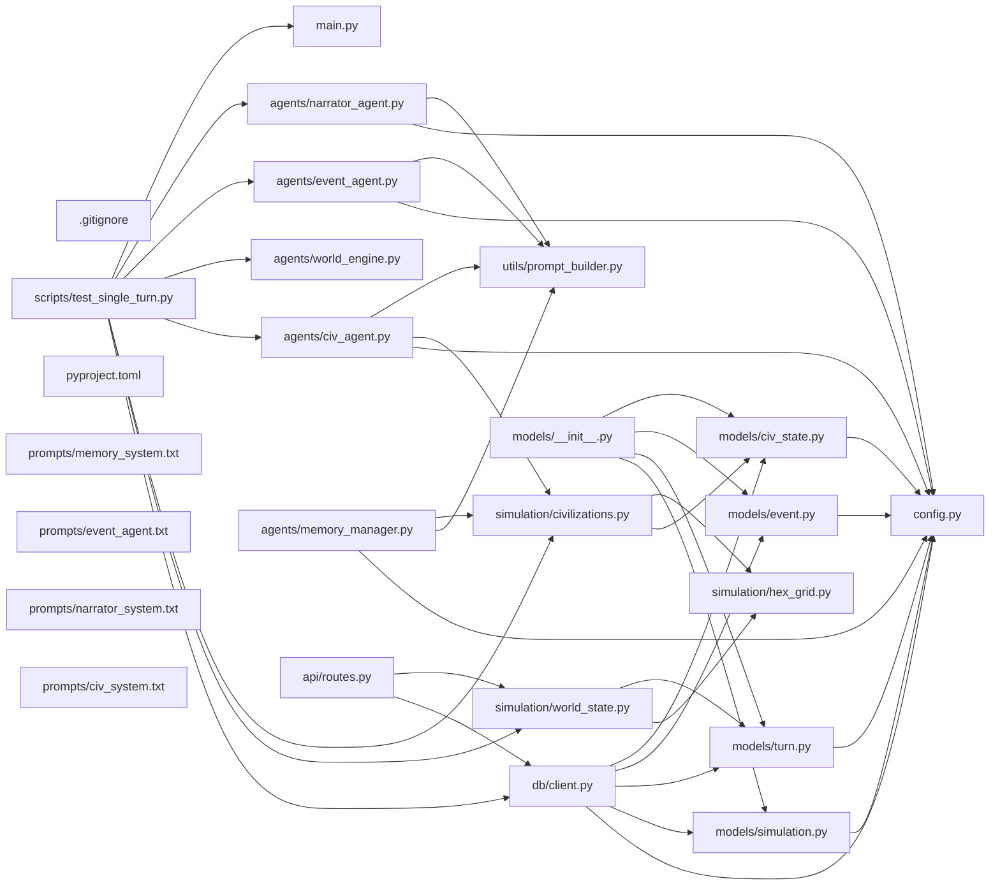

## ARCHITECTURE

A python-based project composed of the following subsystems:

- **models/**: Primary subsystem containing 5 files
- **agents/**: Primary subsystem containing 5 files
- **utils/**: Primary subsystem containing 4 files
- **simulation/**: Primary subsystem containing 4 files
- **Root**: Contains scripts and execution points

## ENTRY_POINTS

### `main.py`

```python
def main():
    print("Hello from backend!")


if __name__ == "__main__":
    main()

```

## SYMBOL_INDEX

**`config.py`**
- class `Settings`

**`utils/prompt_builder.py`**
- `load_template()`
- `build_civ_system_prompt()`
- `build_civ_user_message()`
- `build_world_summary()`
- `build_narrator_user_message()`
- `build_event_agent_user_message()`
- `build_memory_user_message()`

**`models/civ_state.py`**
- class `Resources`
  - `__str__()`
  - `__repr__()`
- class `CivState`

**`main.py`**
- `main()`

**`simulation/civilizations.py`**
- `load_civs_config()`
- `build_initial_civ_states()`
- `get_civ_config()`
- `get_civ_personality()`
- `get_all_civ_ids()`

**`simulation/hex_grid.py`**
- class `Hex`
  - `__add__()`
  - `__sub__()`
  - `length()`
  - `distance()`
- `hex_neighbors()`
- `hex_distance()`
- `hex_ring()`
- `hex_spiral()`
- `hex_to_pixel()`
- `pixel_to_hex()`
- `hex_round()`
- `generate_grid_coords()`
- `get_corner_hexes()`

**`db/client.py`**
- `connect_db()`
- `close_db()`
- `ping_db()`

**`models/turn.py`**
- class `TileSnapshot`
- class `CivResourceSnapshot`
- class `WorldSnapshot`
- class `Turn`

**`simulation/world_state.py`**
- `_load_world_params()`
- `_load_civs_config()`
- `_pick_tile_type()`
- `_get_resource_yield()`
- `_assign_starting_tiles()`
- `generate_world()`
- `world_snapshot_to_dict()`

**`models/event.py`**
- class `EventType`
- class `Event`

**`models/simulation.py`**
- class `SimStatus`
- class `SimConfig`
- class `Simulation`

**`agents/narrator_agent.py`**
- `narrate_turn()`
- `_ordinal()`

**`agents/event_agent.py`**
- `roll_world_event()`
- `_parse_event()`
- `_apply_event()`

**`agents/civ_agent.py`**
- `get_civ_decision()`
- `get_all_civ_decisions()`
- `_parse_and_validate()`
- `_fallback_decision()`

## IMPORTANT_CALL_PATHS

main.main()
## CORE_MODULES

### `config.py`

**Purpose:** Implements config.

**Types:**
- `Settings` (bases: `BaseSettings`)

### `README.md`

**Purpose:** Implements README.

### `utils/prompt_builder.py`

**Purpose:** Builds prompt strings from .txt templates and world state data.

**Functions:**
- `def build_civ_system_prompt(civ_id: str, civ_name: str, traits: list[str], personality: str, ...) -> str`
- `def build_civ_user_message(turn: int, civ_state: dict, world_summary: str, memory_summary: str) -> str`
- `def build_event_agent_user_message(     turn: int,     world_snapshot: dict,     civ_states: dict, ) -> str`
- `def build_memory_user_message(civ_id: str, civ_name: str, event_log: list[dict], current_state: dict) -> str`

### `models/civ_state.py`

**Purpose:** Implements civ state.

**Types:**
- `CivState` (bases: `Document`)
- `Resources` (bases: `BaseModel`) methods: `__repr__`, `__str__`

## SUPPORTING_MODULES

### `simulation/civilizations.py`

> 
Loads civilization configs and builds initial CivState documents
for a new simulation run.


```python
def load_civs_config() -> list[dict]
    """Load raw civ config from JSON."""

def build_initial_civ_states(
    sim_id: str,
    civ_tiles: dict[str, list],  # civ_id → list of starting Hex
) -> list[CivState]
    """Build turn-0 CivState documents for all 4 civs.
    Called once when a simulation starts.

    Args:
        sim_id: The MongoDB ID of the simulation run
        civ_tiles: Mapping from civ_id to their starting tile hexes

    Returns:
        List of CivState documents (not yet inserted to DB)"""

def get_civ_config(civ_id: str) -> dict | None
    """Look up a single civ's config by ID."""

def get_civ_personality(civ_id: str) -> str
    """Return the personality string for use in agent system prompts.
    Returns empty string if civ not found."""

def get_all_civ_ids() -> list[str]

```

### `simulation/hex_grid.py`

> 
Hex grid using axial coordinates (q, r) with pointy-top orientation.

Axial coordinate system:
  - q increases going right
  - r increases going down-right
  - s = -q - r (derived, not stored)

Pointy-top hex means the flat sides face left/right.


```python
class Hex

def hex_neighbors(h: Hex) -> list[Hex]
    """Return all 6 neighbors of a hex."""

def hex_distance(a: Hex, b: Hex) -> int
    """Manhattan distance between two hexes."""

def hex_ring(center: Hex, radius: int) -> list[Hex]
    """Return all hexes exactly `radius` steps from center."""

def hex_spiral(center: Hex, radius: int) -> list[Hex]
    """Return center hex + all hexes within `radius` steps (filled circle)."""

def hex_to_pixel(h: Hex, size: float) -> tuple[float, float]
    """Convert axial hex coords to pixel center (pointy-top).
    `size` is the distance from center to corner."""

def pixel_to_hex(x: float, y: float, size: float) -> Hex
    """Convert pixel coords back to the nearest hex (pointy-top)."""

def hex_round(fq: float, fr: float) -> Hex
    """Round fractional axial coords to the nearest integer hex."""

def generate_grid_coords(grid_size: int) -> list[Hex]
    """Generate all hex coordinates for a rhombus-shaped grid.
    grid_size=15 gives a 15x15 = 225 tile grid.
    Offset so the grid is centred around (0,0)."""

def get_corner_hexes(grid_size: int) -> dict[str, Hex]
    """Return the four corner hexes for a given grid size.
    Used for spawning civilizations."""

```

### `db/client.py`

```python
def connect_db() -> None

def close_db() -> None

def ping_db() -> bool

```

### `models/turn.py`

```python
class TileSnapshot(BaseModel)

class CivResourceSnapshot(BaseModel)

class WorldSnapshot(BaseModel)

class Turn(Document)

```

### `.gitignore`

*98 lines, 0 imports*

### `simulation/world_state.py`

> 
World state generator.
Builds a fresh 15×15 hex grid with tile types, resources, and civ starting positions.


```python
def _load_world_params() -> dict

def _load_civs_config() -> list[dict]

def _pick_tile_type(params: dict, rng: random.Random) -> str
    """Weighted random tile type selection."""

def _get_resource_yield(tile_type: str, params: dict) -> tuple[float, float, float]
    """Return (food, gold, stone) yield for a tile type."""

def _assign_starting_tiles(
    civ_id: str,
    corner: Hex,
    all_hex_set: set[Hex],
    already_owned: set[Hex],
    n: int = 3,
) -> list[Hex]
    """Give a civ `n` contiguous starting tiles centred on its corner.
    Uses spiral expansion so tiles are always adjacent."""

def generate_world(
    grid_size: int | None = None,
    seed: int | None = None,
) -> tuple[WorldSnapshot, dict[str, list[Hex]]]
    """Generate a fresh world.

    Returns:
        world_snapshot: WorldSnapshot — ready to store in MongoDB
        civ_tiles: dict mapping civ_id → list of their starting Hex positions"""

def world_snapshot_to_dict(snapshot: WorldSnapshot) -> dict
    """Serialize WorldSnapshot to a plain dict for API responses."""

```

### `models/event.py`

```python
class EventType(str, Enum)

class Event(Document)

```

### `models/simulation.py`

```python
class SimStatus(str, Enum)

class SimConfig(BaseModel)

class Simulation(Document)

```

### `agents/narrator_agent.py`

> 
Narrator agent — writes 2-3 sentences of historical lore each turn.


```python
def narrate_turn(
    turn: int,
    events: list[dict],
    world_event: dict | None = None,
) -> str
    """Write a historical narrative for the turn.

    Args:
        turn: current turn number
        events: list of resolved event dicts from world engine
        world_event: optional world event dict from event agent

    Returns:
        narrative string (2-3 sentences of lore)"""

def _ordinal(n: int) -> str

```

### `agents/event_agent.py`

> 
Event agent — rolls each turn for a random world event.
20% chance per turn. Uses an LLM to pick the most dramatically interesting event.


```python
def roll_world_event(
    turn: int,
    world_snapshot: dict,
    civ_states: dict,
    force: bool = False,
) -> dict | None
    """Roll for a world event this turn.

    Args:
        turn: current turn number
        world_snapshot: current world state
        civ_states: current civ states
        force: if True, always fire an event (for testing)

    Returns:
        event dict if an event fired, None otherwise"""

def _parse_event(raw: str) -> dict | None

def _apply_event(
    data: dict,
    civ_states: dict,
    world_snapshot: dict,
    turn: int,
) -> dict
    """Apply the event effects to world/civ state and return an event record."""

```

### `agents/civ_agent.py`

> 
Civilization agent — each civ observes the world and returns a structured decision.


```python
def get_civ_decision(
    civ_id: str,
    turn: int,
    civ_state: dict,
    all_civ_states: dict,
    world_snapshot: dict,
    memory_summary: str = "",
    max_retries: int = 2,
) -> dict
    """Ask a civilization agent what it wants to do this turn.

    Returns a validated decision dict:
    {
        "civ_id": str,
        "action": str,
        "target": str | None,
        "reasoning": str,
        "tone": str,
    }"""

def get_all_civ_decisions(
    turn: int,
    civ_states: dict,
    world_snapshot: dict,
    memory_summaries: dict[str, str] | None = None,
) -> dict[str, dict]
    """Ask all alive civs for their decisions in parallel.
    Returns dict mapping civ_id → decision."""

def _parse_and_validate(raw: str, civ_id: str) -> dict | None
    """Parse JSON response and validate it has the required fields."""

def _fallback_decision(civ_id: str, action: str, reasoning: str) -> dict

```

## DEPENDENCY_GRAPH



## RANKED_FILES

| File | Score | Tier | Tokens |
|------|-------|------|--------|
| `config.py` | 0.439 | structured summary | 26 |
| `README.md` | 0.411 | structured summary | 11 |
| `utils/prompt_builder.py` | 0.269 | structured summary | 152 |
| `models/civ_state.py` | 0.257 | structured summary | 54 |
| `main.py` | 0.245 | full source | 32 |
| `simulation/civilizations.py` | 0.226 | signatures | 238 |
| `simulation/hex_grid.py` | 0.226 | signatures | 396 |
| `db/client.py` | 0.221 | signatures | 32 |
| `models/turn.py` | 0.221 | signatures | 35 |
| `.gitignore` | 0.206 | signatures | 13 |
| `simulation/world_state.py` | 0.189 | signatures | 304 |
| `models/event.py` | 0.184 | signatures | 21 |
| `models/simulation.py` | 0.184 | signatures | 29 |
| `agents/narrator_agent.py` | 0.170 | signatures | 132 |
| `agents/event_agent.py` | 0.169 | signatures | 204 |
| `agents/civ_agent.py` | 0.169 | signatures | 271 |
| `agents/world_engine.py` | 0.168 | one-liner | 9 |
| `scripts/test_single_turn.py` | 0.150 | one-liner | 10 |
| `agents/memory_manager.py` | 0.125 | one-liner | 9 |
| `pyproject.toml` | 0.100 | one-liner | 12 |
| `prompts/memory_system.txt` | 0.099 | one-liner | 13 |
| `prompts/event_agent.txt` | 0.099 | one-liner | 13 |
| `prompts/narrator_system.txt` | 0.099 | one-liner | 15 |
| `prompts/civ_system.txt` | 0.099 | one-liner | 14 |
| `models/__init__.py` | 0.075 | one-liner | 17 |
| `api/routes.py` | 0.072 | one-liner | 19 |
| `utils/hex_math.py` | 0.072 | one-liner | 10 |
| `db/indexes.py` | 0.067 | one-liner | 20 |
| `scripts/test_worldgen.py` | 0.061 | one-liner | 10 |
| `scripts/smoke_test.py` | 0.056 | one-liner | 10 |
| `utils/llm.py` | 0.056 | one-liner | 21 |
| `simulation/__init__.py` | 0.035 | one-liner | 17 |
| `api/server.py` | 0.031 | one-liner | 19 |
| `utils/__init__.py` | 0.030 | one-liner | 17 |
| `scripts/test_openrouter.py` | 0.006 | one-liner | 21 |
| `.python-version` | 0.000 | one-liner | 10 |

## PERIPHERY

- `agents/world_engine.py` — 
- `scripts/test_single_turn.py` — 
- `agents/memory_manager.py` — 
- `pyproject.toml` — 36 lines
- `prompts/memory_system.txt` — 26 lines
- `prompts/event_agent.txt` — 36 lines
- `prompts/narrator_system.txt` — 41 lines
- `prompts/civ_system.txt` — 45 lines
- `models/__init__.py` — 4 imports, 11 lines
- `api/routes.py` — 3 functions, 3 imports, 49 lines
- `utils/hex_math.py` — 
- `db/indexes.py` — 1 function, 5 imports, 22 lines
- `scripts/test_worldgen.py` — 
- `scripts/smoke_test.py` — 
- `utils/llm.py` — 1 function, 5 imports, 65 lines
- `simulation/__init__.py` — 3 imports, 9 lines
- `api/server.py` — 1 function, 8 imports, 42 lines
- `utils/__init__.py` — 1 imports, 14 lines
- `scripts/test_openrouter.py` — 1 function, 4 imports, 61 lines
- `.python-version` — 2 lines

