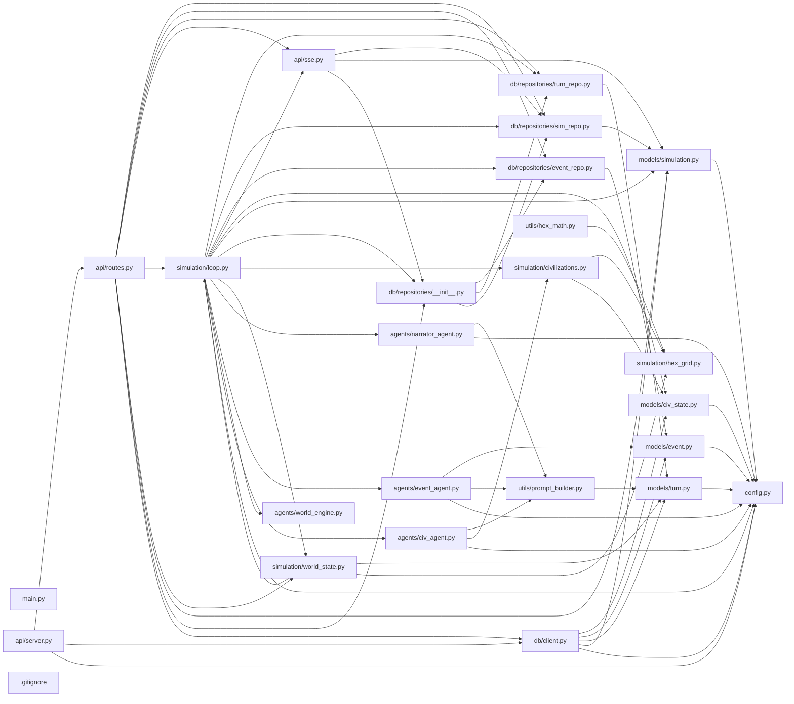

## ARCHITECTURE

A python-based project composed of the following subsystems:

- **db/**: Primary subsystem containing 7 files
- **simulation/**: Primary subsystem containing 6 files
- **models/**: Primary subsystem containing 5 files
- **agents/**: Primary subsystem containing 5 files
- **Root**: Contains scripts and execution points

## ENTRY_POINTS

*No entry points identified within budget.*

## SYMBOL_INDEX

**`config.py`**
- class `Settings`

**`models/turn.py`**
- class `TileSnapshot`
- class `CivResourceSnapshot`
- class `WorldSnapshot`
- class `Turn`

**`models/simulation.py`**
- class `SimStatus`
- class `SimConfig`
- class `Simulation`

**`models/civ_state.py`**
- class `Resources`
  - `__str__()`
  - `__repr__()`
- class `CivState`

**`models/event.py`**
- class `EventType`
- class `Event`

**`main.py`**
- `main()`

**`db/repositories/sim_repo.py`**
- `create_simulation()`
- `get_simulation()`
- `_oid()`
- `_set_fields()`
- `update_sim_turn()`
- `update_sim_status()`
- `mark_sim_stopped()`
- `set_sim_winner()`
- `get_all_simulations()`
- `is_sim_paused()`
- `delete_simulation()`

**`simulation/civilizations.py`**
- `load_civs_config()`
- `build_initial_civ_states()`
- `get_civ_config()`
- `get_civ_personality()`
- `get_all_civ_ids()`

**`simulation/hex_grid.py`**
- class `Hex`
  - `__add__()`
  - `__sub__()`
  - `length()`
  - `distance()`
- `hex_neighbors()`
- `hex_distance()`
- `hex_ring()`
- `hex_spiral()`
- `hex_to_pixel()`
- `pixel_to_hex()`
- `hex_round()`
- `generate_grid_coords()`
- `get_corner_hexes()`

**`db/client.py`**
- `connect_db()`
- `close_db()`
- `ping_db()`

**`api/routes.py`**
- `health()`
- `world_preview()`
- class `StartSimRequest`
- `start_simulation()`
- `pause_simulation()`
- `resume_simulation()`
- `stop_simulation()`
- `delete_sim()`
- `get_sim()`
- `get_sim_events()`
- `get_sim_turns()`
- `list_simulations()`
- `_tile_distribution()`
- `get_sim_summary()`
- `export_simulation()`
- `get_sim_turn()`

**`api/sse.py`**
- class `SseManager`
  - `__init__()`
  - `create_channel()`
  - `publish()`
  - `subscribe()`
  - `close_channel()`
- `stream_simulation()`

**`db/repositories/event_repo.py`**
- `_safe_event_type()`
- `save_events()`
- `get_events_for_turn()`
- `get_events_for_sim()`
- `get_events_as_dicts()`

**`utils/prompt_builder.py`**
- `load_template()`
- `build_civ_system_prompt()`
- `build_civ_user_message()`
- `build_world_summary()`
- `build_narrator_user_message()`
- `build_event_agent_user_message()`
- `build_memory_user_message()`

**`db/repositories/turn_repo.py`**
- `_dict_to_world_snapshot()`
- `save_turn()`
- `get_turn()`
- `get_all_turns()`

**`api/server.py`**
- `lifespan()`

**`simulation/loop.py`**
- `_load_world_params()`
- class `SimState`
- `_civ_doc_to_dict()`
- `increment_turn()`
- `run_civ_agents()`
- `run_world_engine()`
- `run_event_agent()`
- `run_narrator()`
- `refresh_memory()`
- `persist_turn()`
- `check_winner()`
- `should_continue()`
- `build_simulation_graph()`
- `run_simulation_loop()`

## IMPORTANT_CALL_PATHS

main.main()
## CORE_MODULES

### `config.py`

**Purpose:** Implements config.

**Types:**
- `Settings` (bases: `BaseSettings`)

### `README.md`

**Purpose:** Implements README.

### `models/turn.py`

**Purpose:** Implements turn.

**Types:**
- `CivResourceSnapshot` (bases: `BaseModel`)
- `TileSnapshot` (bases: `BaseModel`)
- `Turn` (bases: `Document`)
- `WorldSnapshot` (bases: `BaseModel`)

### `models/simulation.py`

**Purpose:** Implements simulation.

**Types:**
- `SimConfig` (bases: `BaseModel`)
- `SimStatus` (bases: `str, Enum`)
- `Simulation` (bases: `Document`)

### `models/civ_state.py`

**Purpose:** Implements civ state.

**Types:**
- `CivState` (bases: `Document`)
- `Resources` (bases: `BaseModel`) methods: `__repr__`, `__str__`

### `models/event.py`

**Purpose:** Implements event.

**Types:**
- `Event` (bases: `Document`)
- `EventType` (bases: `str, Enum`)

## SUPPORTING_MODULES

### `main.py`

```python
def main()

```

### `db/repositories/sim_repo.py`

> 
Simulation repository — clean data access for Simulation documents.


```python
def create_simulation(
    civ_ids: list[str],
    config: SimConfig | None = None,
) -> Simulation
    """Create and insert a new simulation document."""

def get_simulation(sim_id: str) -> Simulation | None
    """Fetch a simulation by ID."""

def _oid(sim_id: str) -> ObjectId | None

def _set_fields(sim_id: str, fields: dict) -> None
    """Atomic $set on a simulation — never clobbers fields written concurrently
    (e.g. a pause/stop issued from the API while the loop updates the turn)."""

def update_sim_turn(sim_id: str, turn: int) -> None
    """Update the current turn counter."""

def update_sim_status(sim_id: str, status: SimStatus) -> None
    """Update simulation status."""

def mark_sim_stopped(sim_id: str) -> None
    """Terminal stop requested by the user — completed with no winner."""

def set_sim_winner(
    sim_id: str,
    winner_id: str,
    win_type: str,
    final_narrative: str,
) -> None
    """Mark a simulation as complete with a winner."""

def get_all_simulations(limit: int = 20) -> list[Simulation]
    """Fetch recent simulations for the history page."""

def is_sim_paused(sim_id: str) -> bool
    """Check if a simulation has been paused/stopped."""

def delete_simulation(sim_id: str) -> bool
    """Delete a simulation and all its associated data. Returns True if deleted."""

```

### `simulation/civilizations.py`

> 
Loads civilization configs and builds initial CivState documents
for a new simulation run.


```python
def load_civs_config() -> list[dict]
    """Load raw civ config from JSON."""

def build_initial_civ_states(
    sim_id: str,
    civ_tiles: dict[str, list],  # civ_id → list of starting Hex
) -> list[CivState]
    """Build turn-0 CivState documents for all 4 civs.
    Called once when a simulation starts.

    Args:
        sim_id: The MongoDB ID of the simulation run
        civ_tiles: Mapping from civ_id to their starting tile hexes

    Returns:
        List of CivState documents (not yet inserted to DB)"""

def get_civ_config(civ_id: str) -> dict | None
    """Look up a single civ's config by ID."""

def get_civ_personality(civ_id: str) -> str
    """Return the personality string for use in agent system prompts.
    Returns empty string if civ not found."""

def get_all_civ_ids() -> list[str]

```

### `db/repositories/__init__.py`

*42 lines, 3 imports*

### `simulation/hex_grid.py`

> 
Hex grid using axial coordinates (q, r) with pointy-top orientation.

Axial coordinate system:
  - q increases going right
  - r increases going down-right
  - s = -q - r (derived, not stored)

Pointy-top hex means the flat sides face left/right.


```python
class Hex

def hex_neighbors(h: Hex) -> list[Hex]
    """Return all 6 neighbors of a hex."""

def hex_distance(a: Hex, b: Hex) -> int
    """Manhattan distance between two hexes."""

def hex_ring(center: Hex, radius: int) -> list[Hex]
    """Return all hexes exactly `radius` steps from center."""

def hex_spiral(center: Hex, radius: int) -> list[Hex]
    """Return center hex + all hexes within `radius` steps (filled circle)."""

def hex_to_pixel(h: Hex, size: float) -> tuple[float, float]
    """Convert axial hex coords to pixel center (pointy-top).
    `size` is the distance from center to corner."""

def pixel_to_hex(x: float, y: float, size: float) -> Hex
    """Convert pixel coords back to the nearest hex (pointy-top)."""

def hex_round(fq: float, fr: float) -> Hex
    """Round fractional axial coords to the nearest integer hex."""

def generate_grid_coords(grid_size: int) -> list[Hex]
    """Generate all hex coordinates for a rhombus-shaped grid.
    grid_size=15 gives a 15x15 = 225 tile grid.
    Offset so the grid is centred around (0,0)."""

def get_corner_hexes(grid_size: int) -> dict[str, Hex]
    """Return the four corner hexes for a given grid size.
    Used for spawning civilizations."""

```

### `db/client.py`

```python
def connect_db() -> None

def close_db() -> None

def ping_db() -> bool

```

### `api/routes.py`

> 
FastAPI routes — all API endpoints.


```python
def health()

def world_preview(grid_size: int = 15, seed: int | None = None)

class StartSimRequest(BaseModel)

def start_simulation(req: StartSimRequest, background_tasks: BackgroundTasks)

def pause_simulation(sim_id: str)
    """Pause a running simulation — the loop holds after the current turn."""

def resume_simulation(sim_id: str)
    """Resume a paused simulation — the loop picks up on its next poll."""

def stop_simulation(sim_id: str)
    """Permanently stop a simulation — the loop exits after the current turn."""

def delete_sim(sim_id: str)
    """Permanently delete a simulation and all its turns/events."""

def get_sim(sim_id: str)

def get_sim_events(sim_id: str, turn: int | None = None)

def get_sim_turns(sim_id: str)

def list_simulations()

def _tile_distribution(tiles: list[dict]) -> dict[str, int]

def get_sim_summary(sim_id: str)
    """Get aggregated simulation stats."""

def export_simulation(sim_id: str)
    """Export full simulation as JSON — all turns, events, civ states."""

def get_sim_turn(sim_id: str, turn_num: int)
    """Get a specific turn's world snapshot — used by the replay scrubber."""

```

### `api/sse.py`

> 
SSE manager — in-memory pub/sub for streaming simulation turn events.
Each simulation gets its own asyncio.Queue.
Clients connect to GET /api/sim/{id}/stream and receive events as they fire.


```python
class SseManager

def stream_simulation(sim_id: str)
    """SSE endpoint — streams turn events for a running simulation.
    Connect once and receive JSON events as each turn completes."""

```

### `db/repositories/event_repo.py`

> 
Event repository — save and query simulation events.


```python
def _safe_event_type(type_str: str) -> EventType
    """Safely convert string to EventType, falling back to civ_idle."""

def save_events(
    sim_id: str,
    turn: int,
    events: list[dict],
) -> list[Event]
    """Bulk insert events for a turn."""

def get_events_for_turn(sim_id: str, turn: int) -> list[Event]
    """Fetch all events for a specific turn."""

def get_events_for_sim(sim_id: str) -> list[Event]
    """Fetch full event log for a simulation."""

def get_events_as_dicts(sim_id: str) -> list[dict]
    """Fetch full event log as plain dicts for agent memory."""

```

### `utils/prompt_builder.py`

> 
Builds prompt strings from .txt templates and world state data.


```python
def load_template(filename: str) -> str
    """Load a prompt template from the prompts/ directory."""

def build_civ_system_prompt(
    civ_id: str,
    civ_name: str,
    traits: list[str],
    personality: str,
    all_civ_configs: list[dict],
) -> str
    """Build the system prompt for a civilization agent."""

def build_civ_user_message(
    turn: int,
    civ_state: dict,
    world_summary: str,
    memory_summary: str,
) -> str
    """Build the user message for a civilization agent each turn."""

def build_world_summary(
    world_snapshot: dict,
    civ_states: dict,
    exclude_civ_id: str,
) -> str
    """Build a compact world state summary string for injection into civ prompts.
    Excludes the civ's own state (already shown separately)."""

def build_narrator_user_message(
    turn: int,
    turn_diff: dict,
) -> str
    """Build the user message for the narrator agent."""

def build_event_agent_user_message(
    turn: int,
    world_snapshot: dict,
    civ_states: dict,
) -> str
    """Build the user message for the event agent."""

def build_memory_user_message(
    civ_id: str,
    civ_name: str,
    event_log: list[dict],
    current_state: dict,
) -> str
    """Build the user message for the memory manager."""

```

### `db/repositories/turn_repo.py`

> 
Turn repository — save and query turn snapshots.


```python
def _dict_to_world_snapshot(world_dict: dict) -> WorldSnapshot
    """Convert raw world dict to WorldSnapshot model."""

def save_turn(
    sim_id: str,
    turn: int,
    world_snapshot_dict: dict,
) -> Turn
    """Save a turn snapshot to MongoDB."""

def get_turn(sim_id: str, turn: int) -> Turn | None
    """Fetch a specific turn snapshot."""

def get_all_turns(sim_id: str) -> list[Turn]
    """Fetch all turns for a simulation (for replay)."""

```

### `api/server.py`

```python
def lifespan(app: FastAPI)

```

### `simulation/loop.py`

> 
LangGraph simulation loop.
Defines SimState and the full turn-cycle graph:
  increment_turn → run_civ_agents → run_world_engine → run_event_agent
  → run_narrator → refresh_memory → persist_turn → check_winner
  → (winner? END : back to increment_turn)


```python
def _load_world_params() -> dict

class SimState(TypedDict)

def _civ_doc_to_dict(state: CivState) -> dict

def increment_turn(state: SimState) -> SimState

def run_civ_agents(state: SimState) -> SimState

def run_world_engine(state: SimState) -> SimState

def run_event_agent(state: SimState) -> SimState

def run_narrator(state: SimState) -> SimState

def refresh_memory(state: SimState) -> SimState

def persist_turn(state: SimState) -> SimState

def check_winner(state: SimState) -> SimState

def should_continue(state: SimState) -> str

def build_simulation_graph() -> StateGraph

def run_simulation_loop(sim_id: str) -> None
    """Main entry point. Called as a background task from POST /api/sim/start.
    Builds initial state from MongoDB, runs the LangGraph loop until done."""

```

### `.gitignore`

*98 lines, 0 imports*

## DEPENDENCY_GRAPH



### Cyclic Dependencies

> [!WARNING]
> The following circular import chains were detected:

1. `simulation/loop.py` -> `simulation/world_state.py`

## RANKED_FILES

| File | Score | Tier | Tokens |
|------|-------|------|--------|
| `config.py` | 0.433 | structured summary | 26 |
| `README.md` | 0.401 | structured summary | 11 |
| `models/turn.py` | 0.334 | structured summary | 65 |
| `models/simulation.py` | 0.333 | structured summary | 52 |
| `models/civ_state.py` | 0.300 | structured summary | 54 |
| `models/event.py` | 0.300 | structured summary | 38 |
| `main.py` | 0.268 | signatures | 13 |
| `db/repositories/sim_repo.py` | 0.258 | signatures | 349 |
| `simulation/civilizations.py` | 0.234 | signatures | 238 |
| `db/repositories/__init__.py` | 0.224 | signatures | 18 |
| `simulation/hex_grid.py` | 0.200 | signatures | 396 |
| `db/client.py` | 0.200 | signatures | 32 |
| `api/routes.py` | 0.199 | signatures | 287 |
| `api/sse.py` | 0.191 | signatures | 94 |
| `db/repositories/event_repo.py` | 0.159 | signatures | 173 |
| `utils/prompt_builder.py` | 0.159 | signatures | 330 |
| `db/repositories/turn_repo.py` | 0.126 | signatures | 140 |
| `api/server.py` | 0.125 | signatures | 18 |
| `simulation/loop.py` | 0.124 | signatures | 273 |
| `.gitignore` | 0.115 | signatures | 13 |
| `agents/civ_agent.py` | 0.101 | one-liner | 10 |
| `agents/event_agent.py` | 0.101 | one-liner | 9 |
| `agents/narrator_agent.py` | 0.101 | one-liner | 11 |
| `agents/world_engine.py` | 0.101 | one-liner | 9 |
| `simulation/world_state.py` | 0.100 | one-liner | 9 |
| `utils/hex_math.py` | 0.092 | one-liner | 10 |
| `simulation/judge.py` | 0.088 | one-liner | 9 |
| `scripts/test_full_sim.py` | 0.084 | one-liner | 10 |
| `models/__init__.py` | 0.067 | one-liner | 17 |
| `db/repositories/summary_repo.py` | 0.059 | one-liner | 12 |
| `agents/memory_manager.py` | 0.059 | one-liner | 9 |
| `db/indexes.py` | 0.058 | one-liner | 20 |
| `scripts/test_single_turn.py` | 0.051 | one-liner | 10 |
| `scripts/test_worldgen.py` | 0.050 | one-liner | 10 |
| `scripts/smoke_test.py` | 0.050 | one-liner | 10 |
| `utils/llm.py` | 0.050 | one-liner | 21 |
| `simulation/__init__.py` | 0.026 | one-liner | 17 |
| `utils/__init__.py` | 0.020 | one-liner | 17 |
| `pyproject.toml` | 0.001 | one-liner | 12 |
| `prompts/civ_system.txt` | 0.001 | one-liner | 14 |

## PERIPHERY

- `agents/civ_agent.py` — 
- `agents/event_agent.py` — 
- `agents/narrator_agent.py` — 
- `agents/world_engine.py` — 
- `simulation/world_state.py` — 
- `utils/hex_math.py` — 
- `simulation/judge.py` — 
- `scripts/test_full_sim.py` — 
- `models/__init__.py` — 4 imports, 11 lines
- `db/repositories/summary_repo.py` — 
- `agents/memory_manager.py` — 
- `db/indexes.py` — 1 function, 5 imports, 22 lines
- `scripts/test_single_turn.py` — 
- `scripts/test_worldgen.py` — 
- `scripts/smoke_test.py` — 
- `utils/llm.py` — 1 function, 5 imports, 65 lines
- `simulation/__init__.py` — 5 imports, 13 lines
- `utils/__init__.py` — 1 imports, 14 lines
- `pyproject.toml` — 36 lines
- `prompts/civ_system.txt` — 45 lines
- `prompts/event_agent.txt` — 36 lines
- `prompts/memory_system.txt` — 26 lines
- `prompts/narrator_system.txt` — 41 lines
- `scripts/test_openrouter.py` — 1 function, 4 imports, 61 lines
- `.python-version` — 2 lines

