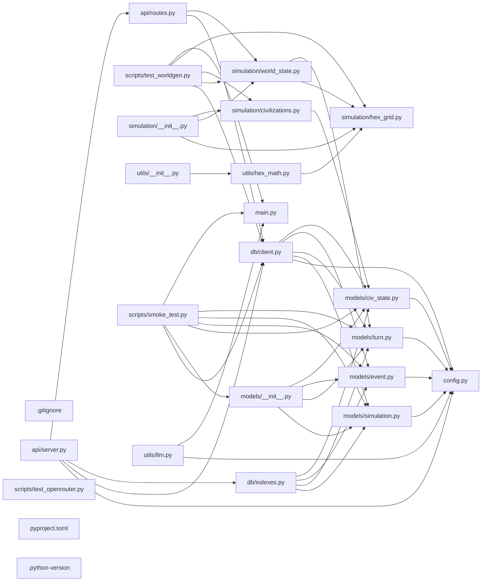

## ARCHITECTURE

A python-based project composed of the following subsystems:

- **models/**: Primary subsystem containing 5 files
- **simulation/**: Primary subsystem containing 4 files
- **utils/**: Primary subsystem containing 3 files
- **scripts/**: Primary subsystem containing 3 files
- **Root**: Contains scripts and execution points

## ENTRY_POINTS

*No entry points identified within budget.*

## SYMBOL_INDEX

**`config.py`**
- class `Settings`

**`models/civ_state.py`**
- class `Resources`
  - `__str__()`
  - `__repr__()`
- class `CivState`

**`models/turn.py`**
- class `TileSnapshot`
- class `CivResourceSnapshot`
- class `WorldSnapshot`
- class `Turn`

**`simulation/hex_grid.py`**
- class `Hex`
  - `__add__()`
  - `__sub__()`
  - `length()`
  - `distance()`
- `hex_neighbors()`
- `hex_distance()`
- `hex_ring()`
- `hex_spiral()`
- `hex_to_pixel()`
- `pixel_to_hex()`
- `hex_round()`
- `generate_grid_coords()`
- `get_corner_hexes()`

**`db/client.py`**
- `connect_db()`
- `close_db()`
- `ping_db()`

**`models/event.py`**
- class `EventType`
- class `Event`

**`models/simulation.py`**
- class `SimStatus`
- class `SimConfig`
- class `Simulation`

**`simulation/world_state.py`**
- `_load_world_params()`
- `_load_civs_config()`
- `_pick_tile_type()`
- `_get_resource_yield()`
- `_assign_starting_tiles()`
- `generate_world()`
- `world_snapshot_to_dict()`

**`main.py`**
- `main()`

## IMPORTANT_CALL_PATHS

main.main()
## CORE_MODULES

### `README.md`

**Purpose:** Implements README.

### `config.py`

**Purpose:** Implements config.

**Types:**
- `Settings` (bases: `BaseSettings`)

### `models/civ_state.py`

**Purpose:** Implements civ state.

**Types:**
- `CivState` (bases: `Document`)
- `Resources` (bases: `BaseModel`) methods: `__repr__`, `__str__`

## SUPPORTING_MODULES

### `models/turn.py`

```python
class TileSnapshot(BaseModel)

class CivResourceSnapshot(BaseModel)

class WorldSnapshot(BaseModel)

class Turn(Document)

```

### `simulation/hex_grid.py`

> 
Hex grid using axial coordinates (q, r) with pointy-top orientation.

Axial coordinate system:
  - q increases going right
  - r increases going down-right
  - s = -q - r (derived, not stored)

Pointy-top hex means the flat sides face left/right.


```python
class Hex

def hex_neighbors(h: Hex) -> list[Hex]
    """Return all 6 neighbors of a hex."""

def hex_distance(a: Hex, b: Hex) -> int
    """Manhattan distance between two hexes."""

def hex_ring(center: Hex, radius: int) -> list[Hex]
    """Return all hexes exactly `radius` steps from center."""

def hex_spiral(center: Hex, radius: int) -> list[Hex]
    """Return center hex + all hexes within `radius` steps (filled circle)."""

def hex_to_pixel(h: Hex, size: float) -> tuple[float, float]
    """Convert axial hex coords to pixel center (pointy-top).
    `size` is the distance from center to corner."""

def pixel_to_hex(x: float, y: float, size: float) -> Hex
    """Convert pixel coords back to the nearest hex (pointy-top)."""

def hex_round(fq: float, fr: float) -> Hex
    """Round fractional axial coords to the nearest integer hex."""

def generate_grid_coords(grid_size: int) -> list[Hex]
    """Generate all hex coordinates for a rhombus-shaped grid.
    grid_size=15 gives a 15x15 = 225 tile grid.
    Offset so the grid is centred around (0,0)."""

def get_corner_hexes(grid_size: int) -> dict[str, Hex]
    """Return the four corner hexes for a given grid size.
    Used for spawning civilizations."""

```

### `db/client.py`

```python
def connect_db() -> None

def close_db() -> None

def ping_db() -> bool

```

### `models/event.py`

```python
class EventType(str, Enum)

class Event(Document)

```

### `models/simulation.py`

```python
class SimStatus(str, Enum)

class SimConfig(BaseModel)

class Simulation(Document)

```

### `simulation/world_state.py`

> 
World state generator.
Builds a fresh 15×15 hex grid with tile types, resources, and civ starting positions.


```python
def _load_world_params() -> dict

def _load_civs_config() -> list[dict]

def _pick_tile_type(params: dict, rng: random.Random) -> str
    """Weighted random tile type selection."""

def _get_resource_yield(tile_type: str, params: dict) -> tuple[float, float, float]
    """Return (food, gold, stone) yield for a tile type."""

def _assign_starting_tiles(
    civ_id: str,
    corner: Hex,
    all_hex_set: set[Hex],
    already_owned: set[Hex],
    n: int = 3,
) -> list[Hex]
    """Give a civ `n` contiguous starting tiles centred on its corner.
    Uses spiral expansion so tiles are always adjacent."""

def generate_world(
    grid_size: int | None = None,
    seed: int | None = None,
) -> tuple[WorldSnapshot, dict[str, list[Hex]]]
    """Generate a fresh world.

    Returns:
        world_snapshot: WorldSnapshot — ready to store in MongoDB
        civ_tiles: dict mapping civ_id → list of their starting Hex positions"""

def world_snapshot_to_dict(snapshot: WorldSnapshot) -> dict
    """Serialize WorldSnapshot to a plain dict for API responses."""

```

### `main.py`

```python
def main()

```

### `.gitignore`

*98 lines, 0 imports*

## DEPENDENCY_GRAPH



## RANKED_FILES

| File | Score | Tier | Tokens |
|------|-------|------|--------|
| `README.md` | 0.500 | structured summary | 11 |
| `config.py` | 0.479 | structured summary | 26 |
| `models/civ_state.py` | 0.366 | structured summary | 54 |
| `models/turn.py` | 0.363 | signatures | 35 |
| `simulation/hex_grid.py` | 0.357 | signatures | 396 |
| `db/client.py` | 0.308 | signatures | 32 |
| `models/event.py` | 0.306 | signatures | 21 |
| `models/simulation.py` | 0.306 | signatures | 29 |
| `simulation/world_state.py` | 0.300 | signatures | 304 |
| `main.py` | 0.271 | signatures | 13 |
| `.gitignore` | 0.247 | signatures | 13 |
| `simulation/civilizations.py` | 0.242 | one-liner | 10 |
| `api/routes.py` | 0.177 | one-liner | 19 |
| `utils/hex_math.py` | 0.177 | one-liner | 10 |
| `scripts/test_worldgen.py` | 0.148 | one-liner | 10 |
| `models/__init__.py` | 0.134 | one-liner | 17 |
| `db/indexes.py` | 0.128 | one-liner | 20 |
| `simulation/__init__.py` | 0.120 | one-liner | 17 |
| `utils/__init__.py` | 0.115 | one-liner | 17 |
| `scripts/smoke_test.py` | 0.097 | one-liner | 10 |
| `utils/llm.py` | 0.095 | one-liner | 21 |
| `api/server.py` | 0.071 | one-liner | 19 |
| `scripts/test_openrouter.py` | 0.045 | one-liner | 21 |
| `pyproject.toml` | 0.044 | one-liner | 12 |
| `.python-version` | 0.000 | one-liner | 10 |

## PERIPHERY

- `simulation/civilizations.py` — 
- `api/routes.py` — 3 functions, 3 imports, 49 lines
- `utils/hex_math.py` — 
- `scripts/test_worldgen.py` — 
- `models/__init__.py` — 4 imports, 11 lines
- `db/indexes.py` — 1 function, 5 imports, 22 lines
- `simulation/__init__.py` — 3 imports, 9 lines
- `utils/__init__.py` — 1 imports, 14 lines
- `scripts/smoke_test.py` — 
- `utils/llm.py` — 1 function, 5 imports, 65 lines
- `api/server.py` — 1 function, 8 imports, 42 lines
- `scripts/test_openrouter.py` — 1 function, 4 imports, 61 lines
- `pyproject.toml` — 37 lines
- `.python-version` — 2 lines

