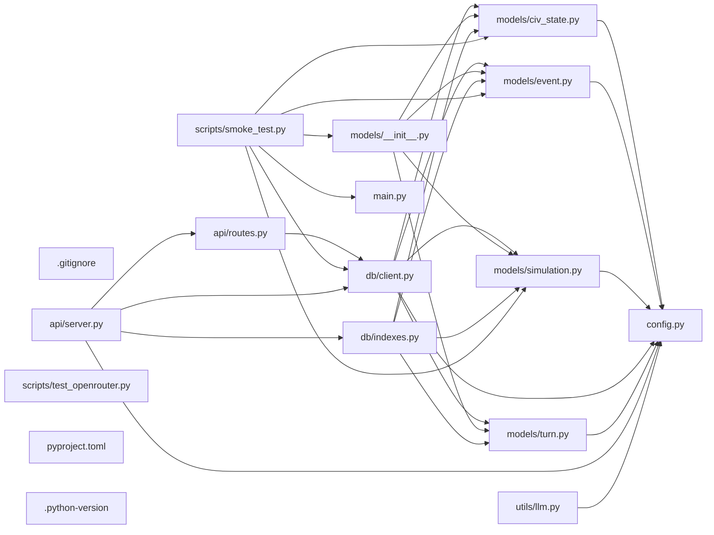

## ARCHITECTURE

A python-based project composed of the following subsystems:

- **models/**: Primary subsystem containing 5 files
- **db/**: Primary subsystem containing 2 files
- **api/**: Primary subsystem containing 2 files
- **scripts/**: Primary subsystem containing 2 files
- **Root**: Contains scripts and execution points

## ENTRY_POINTS

*No entry points identified within budget.*

## SYMBOL_INDEX

**`config.py`**
- class `Settings`

**`models/civ_state.py`**
- class `Resources`
  - `__str__()`
  - `__repr__()`
- class `CivState`

**`models/event.py`**
- class `EventType`
- class `Event`

**`models/simulation.py`**
- class `SimStatus`
- class `SimConfig`
- class `Simulation`

**`db/client.py`**
- `connect_db()`
- `close_db()`
- `ping_db()`

**`models/turn.py`**
- class `TileSnapshot`
- class `CivResourceSnapshot`
- class `WorldSnapshot`
- class `Turn`

## IMPORTANT_CALL_PATHS

main.main()
## CORE_MODULES

### `config.py`

**Purpose:** Implements config.

**Types:**
- `Settings` (bases: `BaseSettings`)

### `.gitignore`

**Purpose:** Implements .gitignore.

## SUPPORTING_MODULES

### `models/civ_state.py`

```python
class Resources(BaseModel)

class CivState(Document)

```

### `models/event.py`

```python
class EventType(str, Enum)

class Event(Document)

```

### `models/simulation.py`

```python
class SimStatus(str, Enum)

class SimConfig(BaseModel)

class Simulation(Document)

```

### `db/client.py`

```python
def connect_db() -> None

def close_db() -> None

def ping_db() -> bool

```

### `models/turn.py`

```python
class TileSnapshot(BaseModel)

class CivResourceSnapshot(BaseModel)

class WorldSnapshot(BaseModel)

class Turn(Document)

```

### `models/__init__.py`

*11 lines, 4 imports*

## DEPENDENCY_GRAPH



## RANKED_FILES

| File | Score | Tier | Tokens |
|------|-------|------|--------|
| `config.py` | 0.522 | structured summary | 26 |
| `.gitignore` | 0.500 | structured summary | 13 |
| `models/civ_state.py` | 0.360 | signatures | 23 |
| `models/event.py` | 0.354 | signatures | 21 |
| `models/simulation.py` | 0.353 | signatures | 29 |
| `db/client.py` | 0.302 | signatures | 32 |
| `models/turn.py` | 0.288 | signatures | 35 |
| `models/__init__.py` | 0.182 | signatures | 16 |
| `db/indexes.py` | 0.179 | one-liner | 20 |
| `api/routes.py` | 0.174 | one-liner | 19 |
| `main.py` | 0.157 | one-liner | 14 |
| `scripts/smoke_test.py` | 0.148 | one-liner | 10 |
| `api/server.py` | 0.122 | one-liner | 19 |
| `utils/llm.py` | 0.115 | one-liner | 21 |
| `scripts/test_openrouter.py` | 0.095 | one-liner | 21 |
| `pyproject.toml` | 0.091 | one-liner | 12 |
| `.python-version` | 0.000 | one-liner | 10 |
| `README.md` | 0.000 | one-liner | 10 |

## PERIPHERY

- `db/indexes.py` — 1 function, 5 imports, 22 lines
- `api/routes.py` — 1 function, 2 imports, 13 lines
- `main.py` — 1 function, 7 lines
- `scripts/smoke_test.py` — 
- `api/server.py` — 1 function, 8 imports, 42 lines
- `utils/llm.py` — 1 function, 5 imports, 65 lines
- `scripts/test_openrouter.py` — 1 function, 4 imports, 61 lines
- `pyproject.toml` — 37 lines
- `.python-version` — 2 lines
- `README.md` — 0 lines

