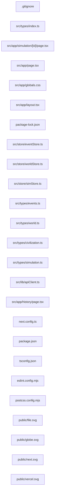

## ARCHITECTURE

A software project composed of the following subsystems:

- **src/**: Primary subsystem containing 14 files
- **public/**: Primary subsystem containing 5 files
- **Root**: Contains scripts and execution points

## ENTRY_POINTS

### `src/types/index.ts`

```typescript
export * from "./simulation"
export * from "./civilization"
export * from "./world"
export * from "./events"
```

## SYMBOL_INDEX

**`src/app/simulation/[id]/page.tsx`**
- `SimulationPage()`

**`src/app/page.tsx`**
- `HomePage()`

**`src/app/layout.tsx`**
- `RootLayout()`

## IMPORTANT_CALL_PATHS

index()
## CORE_MODULES

### `README.md`

**Purpose:** Implements README.

### `.gitignore`

**Purpose:** Implements .gitignore.

### `src/app/simulation/[id]/page.tsx`

**Purpose:** Implements page.

**Functions:**
- `function SimulationPage({ params }: { params: { id: string } })`

## SUPPORTING_MODULES

### `src/app/page.tsx`

```typescript
function HomePage()

```

### `src/app/globals.css`

*27 lines, 0 imports*

### `src/app/layout.tsx`

```typescript
function RootLayout(

```

### `src/store/eventStore.ts`

*25 lines, 2 imports*

### `src/store/worldStore.ts`

*20 lines, 2 imports*

### `src/store/simStore.ts`

*27 lines, 2 imports*

### `src/types/events.ts`

*43 lines, 0 imports*

### `src/types/world.ts`

*33 lines, 0 imports*

## DEPENDENCY_GRAPH



## RANKED_FILES

| File | Score | Tier | Tokens |
|------|-------|------|--------|
| `README.md` | 0.500 | structured summary | 11 |
| `.gitignore` | 0.267 | structured summary | 13 |
| `src/types/index.ts` | 0.165 | full source | 37 |
| `src/app/simulation/[id]/page.tsx` | 0.067 | structured summary | 41 |
| `src/app/page.tsx` | 0.067 | signatures | 16 |
| `src/app/globals.css` | 0.067 | signatures | 16 |
| `src/app/layout.tsx` | 0.067 | signatures | 17 |
| `package-lock.json` | 0.067 | one-liner | 12 |
| `src/store/eventStore.ts` | 0.066 | signatures | 16 |
| `src/store/worldStore.ts` | 0.066 | signatures | 16 |
| `src/store/simStore.ts` | 0.066 | signatures | 17 |
| `src/types/events.ts` | 0.065 | signatures | 15 |
| `src/types/world.ts` | 0.065 | signatures | 15 |
| `src/types/civilization.ts` | 0.065 | one-liner | 14 |
| `src/types/simulation.ts` | 0.065 | one-liner | 13 |
| `src/lib/apiClient.ts` | 0.065 | one-liner | 17 |
| `src/app/history/page.tsx` | 0.065 | one-liner | 22 |
| `next.config.ts` | 0.065 | one-liner | 11 |
| `package.json` | 0.038 | one-liner | 10 |
| `AGENTS.md` | 0.038 | one-liner | 11 |
| `CLAUDE.md` | 0.038 | one-liner | 12 |
| `tsconfig.json` | 0.038 | one-liner | 11 |
| `eslint.config.mjs` | 0.000 | one-liner | 16 |
| `postcss.config.mjs` | 0.000 | one-liner | 13 |
| `public/file.svg` | 0.000 | one-liner | 11 |
| `public/globe.svg` | 0.000 | one-liner | 12 |
| `public/next.svg` | 0.000 | one-liner | 12 |
| `public/vercel.svg` | 0.000 | one-liner | 13 |
| `public/window.svg` | 0.000 | one-liner | 11 |

## PERIPHERY

- `package-lock.json` — 7401 lines
- `src/types/civilization.ts` — 33 lines
- `src/types/simulation.ts` — 22 lines
- `src/lib/apiClient.ts` — 1 function, 20 lines
- `src/app/history/page.tsx` — 1 function, 1 imports, 17 lines
- `next.config.ts` — 8 lines
- `package.json` — 31 lines
- `AGENTS.md` — 6 lines
- `CLAUDE.md` — 2 lines
- `tsconfig.json` — 35 lines
- `eslint.config.mjs` — 3 imports, 19 lines
- `postcss.config.mjs` — 8 lines
- `public/file.svg` — 1 lines
- `public/globe.svg` — 1 lines
- `public/next.svg` — 1 lines
- `public/vercel.svg` — 1 lines
- `public/window.svg` — 1 lines

