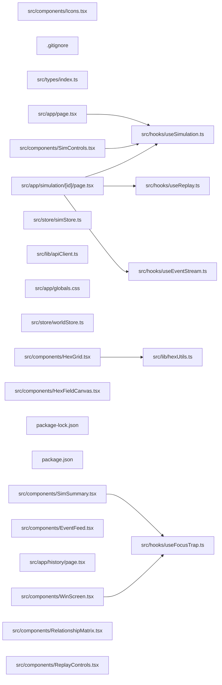

## ARCHITECTURE

A software project composed of the following subsystems:

- **src/**: Primary subsystem containing 38 files
- **public/**: Primary subsystem containing 5 files
- **Root**: Contains scripts and execution points

## ENTRY_POINTS

*No entry points identified within budget.*

## SYMBOL_INDEX

**`src/hooks/useSimulation.ts`**
- `useSimulation()`

**`src/hooks/useFocusTrap.ts`**
- `useFocusTrap()`

**`src/hooks/useEventStream.ts`**
- `sleep()`
- `computeRelationshipShifts()`
- `useEventStream()`

**`src/lib/hexUtils.ts`**
- `hexToPixel()`
- `hexCorners()`
- `tilesBounds()`
- `gridBounds()`

**`src/hooks/useReplay.ts`**
- `useReplay()`

**`src/components/Icons.tsx`**
- `icon()`

**`src/app/page.tsx`**
- `HomePage()`
- `StatBox()`

**`src/app/simulation/[id]/page.tsx`**
- `SimulationPage()`

**`src/components/SimControls.tsx`**
- `SimControls()`

**`src/lib/apiClient.ts`**
- `apiFetch()`

**`src/components/HexGrid.tsx`**
- `tileKey()`
- `HexGrid()`
- `getTileFill()`
- `getTileStroke()`
- `blendColors()`
- `hexToRgb()`

**`src/components/HexFieldCanvas.tsx`**
- `HexFieldCanvas()`

**`src/components/SimSummary.tsx`**
- `SimSummary()`

**`src/components/EventFeed.tsx`**
- `eventMatchesFilter()`
- `EventFeed()`
- `NarratorBlock()`
- `EventCard()`
- `RelationshipShiftCard()`
- `buildTurns()`

## IMPORTANT_CALL_PATHS

index()
## CORE_MODULES

### `src/hooks/useSimulation.ts`

**Purpose:** Implements useSimulation.

**Functions:**
- `function useSimulation()`

### `src/hooks/useFocusTrap.ts`

**Purpose:** Implements useFocusTrap.

**Functions:**
- `function useFocusTrap<T extends HTMLElement>(active: boolean)`

### `README.md`

**Purpose:** Implements README.

### `src/hooks/useEventStream.ts`

**Purpose:** Implements useEventStream.

**Functions:**
- `function computeRelationshipShifts(`
- `const sleep = ...`
- `function useEventStream(simId: string | null)`

### `src/lib/hexUtils.ts`

**Purpose:** Implements hexUtils.

**Functions:**
- `function gridBounds(gridSize = 15, size = HEX_SIZE)`
- `function hexCorners(cx: number, cy: number, size = HEX_SIZE): string`
- `function hexToPixel(q: number, r: number, size = HEX_SIZE)`
- `function tilesBounds(tiles: Array<{ q: number; r: number }>, size = HEX_SIZE)`

### `src/hooks/useReplay.ts`

**Purpose:** Implements useReplay.

**Functions:**
- `function useReplay(simId: string, totalTurns: number)`

### `src/components/Icons.tsx`

**Purpose:** Implements Icons.

**Functions:**
- `const icon = ...`

## SUPPORTING_MODULES

### `CLAUDE.md`

*2 lines, 0 imports*

### `.gitignore`

*62 lines, 0 imports*

### `src/types/index.ts`

*4 lines, 0 imports*

### `src/app/page.tsx`

```typescript
function HomePage()

function StatBox({ label, value, color, accent }: { label: string; value: number; color?: string; accent: string })

```

### `src/app/simulation/[id]/page.tsx`

```typescript
function SimulationPage()

```

### `src/components/SimControls.tsx`

```typescript
function SimControls(

```

### `src/store/simStore.ts`

*31 lines, 2 imports*

### `src/lib/apiClient.ts`

```typescript
async function apiFetch<T>(path: string, options?: RequestInit): Promise<T>

```

### `src/app/globals.css`

*241 lines, 0 imports*

### `src/store/worldStore.ts`

*63 lines, 2 imports*

### `src/components/HexGrid.tsx`

```typescript
const tileKey = ...

function HexGrid()

function getTileFill(d: HexTile): string

function getTileStroke(d: HexTile): string

function blendColors(base: string, overlay: string, alpha: number): string

function hexToRgb(hex: string)

```

### `src/components/HexFieldCanvas.tsx`

```typescript
function HexFieldCanvas()

```

### `src/components/SimSummary.tsx`

```typescript
function SimSummary({ simId, isVisible, onClose }: SimSummaryProps)

```

### `src/components/EventFeed.tsx`

```typescript
function eventMatchesFilter(type: string, filter: FeedFilter): boolean

function EventFeed()

function NarratorBlock({ turn, text, isLatest }: { turn: number; text: string; isLatest: boolean })

function EventCard({ event }: { event: SimEvent })

function RelationshipShiftCard({ event }: { event: SimEvent })

function buildTurns(

```

## DEPENDENCY_GRAPH



## RANKED_FILES

| File | Score | Tier | Tokens |
|------|-------|------|--------|
| `src/hooks/useSimulation.ts` | 0.500 | structured summary | 26 |
| `src/hooks/useFocusTrap.ts` | 0.461 | structured summary | 35 |
| `README.md` | 0.401 | structured summary | 11 |
| `src/hooks/useEventStream.ts` | 0.233 | structured summary | 49 |
| `src/lib/hexUtils.ts` | 0.231 | structured summary | 100 |
| `src/hooks/useReplay.ts` | 0.195 | structured summary | 38 |
| `src/components/Icons.tsx` | 0.135 | structured summary | 26 |
| `CLAUDE.md` | 0.119 | signatures | 15 |
| `.gitignore` | 0.115 | signatures | 13 |
| `src/types/index.ts` | 0.100 | signatures | 15 |
| `src/app/page.tsx` | 0.100 | signatures | 45 |
| `src/app/simulation/[id]/page.tsx` | 0.100 | signatures | 22 |
| `src/components/SimControls.tsx` | 0.100 | signatures | 19 |
| `src/store/simStore.ts` | 0.100 | signatures | 17 |
| `src/lib/apiClient.ts` | 0.100 | signatures | 31 |
| `src/app/globals.css` | 0.099 | signatures | 16 |
| `src/store/worldStore.ts` | 0.098 | signatures | 16 |
| `src/components/HexGrid.tsx` | 0.098 | signatures | 71 |
| `src/components/HexFieldCanvas.tsx` | 0.097 | signatures | 21 |
| `package-lock.json` | 0.097 | one-liner | 12 |
| `package.json` | 0.097 | one-liner | 10 |
| `src/components/SimSummary.tsx` | 0.061 | signatures | 30 |
| `src/components/EventFeed.tsx` | 0.061 | signatures | 90 |
| `src/app/history/page.tsx` | 0.061 | one-liner | 22 |
| `src/components/WinScreen.tsx` | 0.061 | one-liner | 23 |
| `src/components/RelationshipMatrix.tsx` | 0.061 | one-liner | 23 |
| `src/components/ReplayControls.tsx` | 0.061 | one-liner | 24 |
| `src/components/TurnTimeline.tsx` | 0.061 | one-liner | 23 |
| `src/app/layout.tsx` | 0.061 | one-liner | 21 |
| `src/components/ConfirmDialog.tsx` | 0.061 | one-liner | 23 |
| `src/components/ErrorBoundary.tsx` | 0.061 | one-liner | 22 |
| `src/components/ToastNotification.tsx` | 0.061 | one-liner | 23 |
| `src/lib/civColors.ts` | 0.061 | one-liner | 18 |
| `src/types/events.ts` | 0.061 | one-liner | 12 |
| `src/components/CivPanel.tsx` | 0.061 | one-liner | 23 |
| `src/store/toastStore.ts` | 0.061 | one-liner | 18 |
| `src/store/uiStore.ts` | 0.061 | one-liner | 17 |
| `src/components/Skeletons.tsx` | 0.002 | one-liner | 19 |
| `src/components/Spinner.tsx` | 0.001 | one-liner | 18 |
| `next.config.ts` | 0.000 | one-liner | 11 |

## PERIPHERY

- `package-lock.json` — 7466 lines
- `package.json` — 33 lines
- `src/app/history/page.tsx` — 1 function, 7 imports, 324 lines
- `src/components/WinScreen.tsx` — 2 functions, 8 imports, 229 lines
- `src/components/RelationshipMatrix.tsx` — 2 functions, 3 imports, 92 lines
- `src/components/ReplayControls.tsx` — 1 function, 2 imports, 86 lines
- `src/components/TurnTimeline.tsx` — 1 function, 2 imports, 54 lines
- `src/app/layout.tsx` — 1 function, 4 imports, 38 lines
- `src/components/ConfirmDialog.tsx` — 1 function, 2 imports, 74 lines
- `src/components/ErrorBoundary.tsx` — 1 class, 1 imports, 47 lines
- `src/components/ToastNotification.tsx` — 1 function, 2 imports, 48 lines
- `src/lib/civColors.ts` — 2 imports, 62 lines
- `src/types/events.ts` — 44 lines
- `src/components/CivPanel.tsx` — 7 functions, 5 imports, 256 lines
- `src/store/toastStore.ts` — 1 imports, 38 lines
- `src/store/uiStore.ts` — 1 imports, 32 lines
- `src/components/Skeletons.tsx` — 3 functions, 52 lines
- `src/components/Spinner.tsx` — 1 function, 6 lines
- `next.config.ts` — 8 lines
- `src/store/eventStore.ts` — 2 imports, 25 lines
- `src/types/civilization.ts` — 33 lines
- `src/types/simulation.ts` — 22 lines
- `src/types/world.ts` — 33 lines
- `AGENTS.md` — 6 lines
- `tsconfig.json` — 35 lines
- `eslint.config.mjs` — 3 imports, 19 lines
- `postcss.config.mjs` — 8 lines
- `public/file.svg` — 1 lines
- `public/globe.svg` — 1 lines
- `public/next.svg` — 1 lines
- `public/vercel.svg` — 1 lines
- `public/window.svg` — 1 lines

